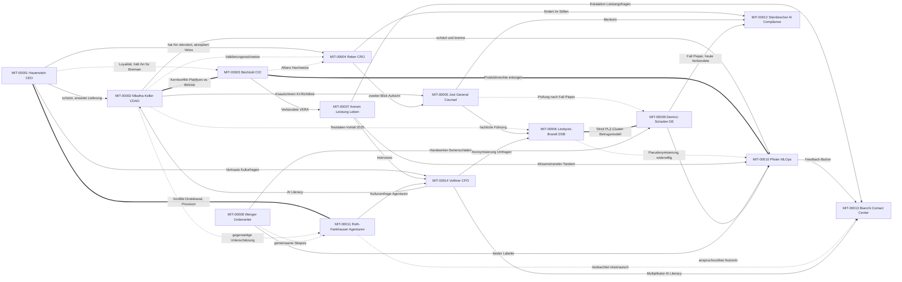

# Personas

Die Personas tragen die Storylines des Datensatzes. Jede spätere Korrespondenz, jedes Protokoll und jede Beschwerde lässt sich auf eine dieser Personen zurückführen. Maschinenlesbar in `data/reference/personas_mitarbeiter.csv` und `data/reference/personas_kunden.csv`.

Alle Personen sind frei erfunden. Namen wurden gegen `data/reference/namen/blocklist.csv` geprüft, Adressen verwenden reale Postleitzahlen und Orte mit generierten Strassennamen, Telefonnummern und E-Mail-Domains stammen ausschliesslich aus den Fiktionsbereichen der Konventionen.

## Mitarbeiter-Personas

| ID | Name | Rolle | Einheit | Standort | Herkunft | Haltung zu KI |
|---|---|---|---|---|---|---|
| MIT-00001 | Beatrice Hauenstein | CEO | GL | Olten | Pfefferminz (seit 2021) | treibend, ungeduldig |
| MIT-00002 | Dr. Lena Mbatha-Keller | Chief Data & AI Officer | DAO | Berlin | Minzia (Mitgründerin) | treibend, visionär |
| MIT-00003 | Urs Bächtold | CIO, Migration Office | IT | Olten | Pfefferminz (seit 1997) | skeptisch-vorsichtig |
| MIT-00004 | Dr. Konstantin Reber | Chief Risk Officer | RM | Olten | extern (2024) | neutral, verlangt Nachweise |
| MIT-00005 | Martina Jost | General Counsel, Chief Compliance Officer | LEGAL | Olten | Pfefferminz (seit 2008) | rechtlich getrieben, konstruktiv |
| MIT-00006 | Sven Lindqvist-Brandt | Datenschutzbeauftragter Gruppe | DSB | Leipzig | Pfefferminz DE (seit 2016) | kritisch-konstruktiv |
| MIT-00007 | Ruth Amrein | Leiterin Leistungsprüfung Leben CH | SL-LV-CH | Olten | Pfefferminz (seit 1994) | ablehnend bis resigniert |
| MIT-00008 | Tobias Wenger | Senior Underwriter Haftpflicht CH | UW-HP-CH | Zürich | Pfefferminz (seit 2010) | pragmatisch |
| MIT-00009 | Aylin Demirci | Teamleiterin Schaden Haftpflicht DE | SL-HP-DE | Leipzig | Pfefferminz DE (seit 2014) | begeistert, fordernd |
| MIT-00010 | Jonas Pfister | ML Engineer, Lead MLOps | DAO-MLOPS | Berlin | Minzia (seit 2020) | technik-optimistisch |
| MIT-00011 | Isabelle Roth-Fankhauser | Leiterin Agenturvertrieb CH | VT-AG-CH | Bern | Pfefferminz (seit 2003) | bedroht, aber nicht blind |
| MIT-00012 | Miriam Steinbrecher | Compliance Officer DE, AI Compliance Officer | COMP-DE | Leipzig | Pfefferminz DE (seit 2019) | neugierig, gründlich |
| MIT-00013 | Dario Bianchi | Kundenberater Contact Center | KS-CH | Olten | neu (2025) | nutzt Assistenten täglich |
| MIT-00014 | Hanna Vollmer | Chief People Officer, Integrationsbüro | HR | Olten und Leipzig | extern (2025) | KI als Kulturthema |

Die vakante Rolle **Chief AI & Data Officer der Gruppe (CAIDO)** ist bewusst nicht besetzt: Seminarteilnehmer übernehmen sie. Die CDAO (MIT-00002) führt das operative Data & AI Office.

## Kunden-Personas

| ID | Name | Typ / Markt | Produkte | Storyline |
|---|---|---|---|---|
| PTR-00000001 | Simone Niederberger | Privat CH, Luzern | Privathaftpflicht, Risikoleben, Säule 3a | Dubletten in HAPO und VERA, korrekte automatische Kleinschadenzahlung |
| PTR-00000002 | Jana Ortlepp | Privat DE, Leipzig | Privathaftpflicht (Minzia), Risikoleben | Widerruf und Neuabschluss, Chatbot mit einer Fehlantwort |
| PTR-00000003 | Schreinerei Kaufmann + Söhne GmbH | Gewerbe CH, Lenzburg | Betriebshaftpflicht, Kollektiv-Risikoleben | Grossschaden Wasser CHF 180'000, Regress, Sanierung |
| PTR-00000004 | Bergmann Gebäudetechnik GmbH & Co. KG | Gewerbe DE, Pirna | Betriebshaftpflicht, RentePlus (Geschäftsführerin) | Unangezeigte Risikoerhöhung Photovoltaik, Beratungsprotokoll, Nachtrag |
| PTR-00000005 | Elisabeth Vogt-Schnyder | Leben CH, Solothurn | Kapitalversicherung PK-95, Leibrente, Privathaftpflicht | Ablauf, Bezugsrecht nach Tod des Ehemanns, Stempelabgabe, Briefkundin |
| PTR-00000006 | Dr. Farid Nazari | Leben DE, München | RentePlus, Risikoleben EUR 1.2 Mio. | Zuschlag wegen Vorerkrankung, verlangt Erklärung des Entscheids |
| PTR-00000007 | Leon Waibel | Privat CH, Zürich | Privathaftpflicht, Säule 3a | Volldigital, Beitragspause, Kündigung, Chat-Halluzination |
| PTR-00000008 | Hans-Georg Pieper | Privat DE, Dresden | Privathaftpflicht mit Hundebaustein | Automatisierte Fehlablehnung, Ombudsmann, BaFin, Richtlinienänderung |
| PTR-00000009 | Transportlogistik Grimm e.K. | Gewerbe DE, Königs Wusterhausen | Betriebshaftpflicht, Privathaftpflicht | Serienbetrug, Betrugsmodell, PLZ-Cluster-Fairness, Strafanzeige |
| PTR-00000010 | Nadia Ferreira-Bucher | Leben CH, Basel | Vorsorge 3b mit Einmalprämie CHF 450'000 | AML-Prüfung mit PEP-Bezug, unauffällig; Beratungsfehler Makler |

Abweichungen von der Planung: Die Basisrente (PTR-00000006) und die betriebliche Altersversorgung (PTR-00000004) sind gemäss Entscheidung E06 und dem Produktportfolio durch RentePlus ersetzt.

## Beziehungen zwischen den Mitarbeiter-Personas

Durchgezogene Pfeile zeigen Zusammenarbeit, gestrichelte Linien Spannungen, dicke Linien offene Konflikte.

## Verknüpfungen zwischen Kunden und Mitarbeitern

| Kunde | Beteiligte Mitarbeiter |
|---|---|
| PTR-00000003 Kaufmann | Tobias Wenger (Sanierung), Schaden CH |
| PTR-00000005 Vogt-Schnyder | Ruth Amrein (Bezugsrechtsprüfung), Dario Bianchi (Anfrage 2025) |
| PTR-00000006 Nazari | Underwriting DE, Sven Lindqvist-Brandt (Auskunftsersuchen) |
| PTR-00000007 Waibel | Dario Bianchi (Video-Beratung), Jonas Pfister (Chat-Fehlerprotokoll) |
| PTR-00000008 Pieper | Aylin Demirci, Miriam Steinbrecher, Jonas Pfister, Martina Jost |
| PTR-00000009 Grimm | Aylin Demirci, Sven Lindqvist-Brandt, Special Investigation Unit |
| PTR-00000010 Ferreira-Bucher | Martina Jost (Geldwäscherei-Fachstelle) |

---

Fiktives Lehrbeispiel. Alle Daten synthetisch. Keine Verbindung zu realen Personen, Unternehmen oder Marken.
