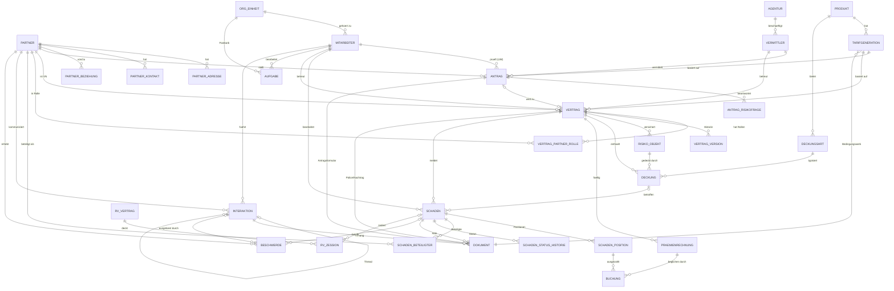

# Pfefferminzia – Datenarchitektur des synthetischen Lehr-Datensatzes

**Dokument:** 03-datenarchitektur.md
**Status:** Planungsentwurf v0.1 (2026-09-03)
**Verantwortung:** Datenarchitektur (technische und strukturelle Architektur)
**Abgrenzung:** Fachliche Inhalte je Sparte (Bedingungswerke, Tariflogik, Schadenszenarien) werden von den Fachteams geliefert. Dieses Dokument definiert das Gerüst, in das diese Inhalte eingehängt werden.

---

## 0. Zusammenfassung und Leitprinzipien

| # | Prinzip | Konsequenz für die Architektur |
|---|---------|--------------------------------|
| P1 | **Eine Wahrheit, zwei Sichten** | Der Generator erzeugt zuerst eine konsistente "wahre Welt" (latent). Daraus werden (a) die sichtbaren, absichtlich verschmutzten Quellsystem-Extrakte und (b) die Ground-Truth-Labels abgeleitet. Teilnehmer sehen nie die Wahrheit direkt. |
| P2 | **Drei Schichten: raw / curated / truth** | `raw` = zwei Quellsysteme mit Legacy-Realismus; `curated` = harmonisiertes, dokumentiertes Zielmodell; `truth` = versteckte Labels, nur für Trainer und Auswertung. |
| P3 | **Werkzeugneutral** | Jede Tabelle liegt als CSV, Parquet und in einer SQLite-Datei vor; Dokumente als Markdown-Quelle plus gerenderte PDF/DOCX; E-Mails als EML. Ein kleines Sample-Paket (< 20 MB) ist für Datei-Upload in ChatGPT/Claude gedacht. |
| P4 | **Reproduzierbar** | Master-Seed, abgeleitete Seeds je Modul und Entität, versionierte Konfiguration, LLM-Texte mit Cache und Prompt-Hash. Jeder Release ist byte-identisch nachbaubar (bis auf LLM-Stufe, die per Cache eingefroren wird). |
| P5 | **Fiktiv, aber plausibel** | Keine realen Personen, Firmen, Straßen, Telefonnummern oder Domains. Realistische Verteilungen (Alter, PLZ-Räume, Schadenhöhen, Saisonalität) bleiben erhalten. |
| P6 | **Handhabbar** | Größte Tabelle ≤ 1,2 Mio. Zeilen; Kernpaket ≤ 250 MB; alles auf einem Laptop in Excel (mit Einschränkungen), Python, SQLite und No-Code-Tools bearbeitbar. |
| P7 | **Didaktik vor Vollständigkeit** | Das Modell enthält bewusst nur die Entitäten, die in den Use-Cases gebraucht werden. Kein Rechnungswesen-Hauptbuch, keine Provisionsabrechnung im Detail, Rückversicherung optional. |

### Narrativ, das die Datenstruktur begründet

| Ereignis | Datum | Auswirkung auf Daten |
|----------|-------|----------------------|
| Pfefferminz Versicherung AG gegründet (Sitz: Basel, Niederlassung Freiburg i. Br.) | fiktiv 1952 | Altbestand Leben ab 1996, Haftpflicht ab 2001 in den Daten sichtbar |
| Einführung Host-System **PVS** (Pfefferminz Verwaltungssystem), zwei Sparten-Instanzen PVS-H (Haftpflicht) und PVS-L (Leben) | 1994 | Legacy-Konventionen, Partner-Dubletten zwischen Sparten |
| Minzia GmbH gegründet (Berlin), digitaler Direktversicherer Haftpflicht, später Risiko-Leben | 2018-03 | Neusystem **MINT** (Minzia Insurance Technology), UUIDs, JSON-Events, Schema-Drift |
| Fusion zur **Pfefferminzia AG** (Legal Day 1) | 2023-07-01 | Ab hier gemeinsame Marke; Mitarbeiter und Vermittler beider Häuser |
| Migration Welle 1: PVS-H → MINT | 2024-04-01 | Migrationsartefakte in MINT (Legacy-Attribute, Mapping-Tabelle) |
| Migration Welle 2: PVS-L → MINT | 2024-11-01 | Leben-Bestand mit Konvertierungsproblemen |
| PVS nur noch lesend (Archiv) | 2025-01-01 | Letzter PVS-Extrakt = Snapshot 2024-12-31 |
| **Stichtag des Datensatzes** | **2025-12-31** | MINT-Snapshot, alle Bewegungsdaten bis hier |

---

## 1. Entitätsmodell

### 1.1 Überblick der Entitäten (curated-Schicht)

Namenskonvention: deutsche Fachbegriffe, `snake_case`, ASCII ohne Umlaute (`praemie`, nicht `prämie`). Primärschlüssel in curated sind lesbare, präfixierte Strings (`PTR-00012345`), damit Excel-Nutzer nicht mit UUIDs kämpfen und LLM-Tools IDs zuverlässig zitieren. Quellsystem-IDs werden in `*_xref`-Tabellen mitgeführt.

| Entität (Tabelle) | Beschreibung | Primärschlüssel | Wichtige Fremdschlüssel | Kardinalitäten |
|---|---|---|---|---|
| `partner` | Natürliche oder juristische Person (Kunde, Geschädigter, Begünstigter, Arzt, Anwalt …) | `partner_id` (PTR-nnnnnnnn) | – | 1 Partner : n Adressen, n Rollen |
| `partner_adresse` | Adress-Historie (Wohn-, Korrespondenz-, Rechnungsadresse) | `adresse_id` (ADR-…) | `partner_id` | n : 1 Partner; zeitlich überlappungsfrei je Typ |
| `partner_kontakt` | Kontaktkanäle (E-Mail, Telefon, Portal-Account), inkl. Einwilligungen | `kontakt_id` | `partner_id` | n : 1 |
| `partner_beziehung` | Beziehungen Partner–Partner (Ehepartner, Kind, Firmeninhaber, Vertreter) | `beziehung_id` | `partner_id_von`, `partner_id_zu` | n : m |
| `vermittler` | Vermittler (Agentur-Mitarbeiter, Makler, Direktkanal, Vergleichsportal) | `vermittler_id` (VMT-…) | `agentur_id` | n : 1 Agentur |
| `agentur` | Agentur / Maklerhaus / Vertriebskanal-Organisation | `agentur_id` (AGT-…) | `region_id` | 1 : n Vermittler |
| `mitarbeiter` | Interne Sachbearbeiter, Underwriter, Schadenexperten, Vertrieb, Compliance | `mitarbeiter_id` (MA-…) | `org_einheit_id`, `vorgesetzter_id` | n : 1 Org-Einheit |
| `org_einheit` | Organisationseinheit (Team Schaden HP CH, Underwriting Leben DE …) | `org_einheit_id` | `parent_id` | Hierarchie |
| `produkt` | Produkt (HP Privat, HP Betrieb, Risiko-LV, Kapital-LV, Rente) je Markt | `produkt_id` (PRD-…) | – | 1 : n Tarifgenerationen |
| `tarifgeneration` | Tarifgeneration/Bedingungswerk-Version (z. B. HP-Privat CH 2019) | `tarifgeneration_id` (TG-…) | `produkt_id`, `bedingungswerk_dokument_id` | n : 1 Produkt; 1 : n Verträge |
| `deckungsart` | Katalog der Bausteine (Grunddeckung, Hundehalter, Schlüsselverlust, Mietsachschaden, BU-Zusatz …) | `deckungsart_id` | `produkt_id` | 1 : n Deckungen |
| `antrag` | Antrag/Offerte inkl. Underwriting-Ergebnis; Vorstufe zum Vertrag | `antrag_id` (ANT-…) | `partner_id`, `vermittler_id`, `tarifgeneration_id`, `underwriter_id` | 1 Antrag : 0..1 Vertrag |
| `antrag_risikofrage` | Antwort auf Risiko-/Gesundheitsfragen (Leben) bzw. Betriebsfragen (HP Betrieb) | `antrag_id`, `frage_code` | `antrag_id` | n : 1 |
| `vertrag` | Versicherungsvertrag (Police) mit aktuellem Stand | `vertrag_id` (POL-…) | `versicherungsnehmer_id`, `tarifgeneration_id`, `vermittler_id`, `antrag_id`, `sachbearbeiter_id` | 1 : n Deckungen, 1 : n Versionen |
| `vertrag_version` | Nachträge/Änderungshistorie (Prämienanpassung, Adressänderung, Bausteinwechsel, Storno) | `vertrag_version_id` | `vertrag_id` | n : 1; lückenlose Zeitscheiben |
| `vertrag_partner_rolle` | Rolle eines Partners im Vertrag (VN, versicherte Person, Begünstigter, Zahler, mitversicherte Person) | `vertrag_id`, `partner_id`, `rolle`, `gueltig_von` | beide | n : m |
| `deckung` | Konkrete Deckung/Baustein im Vertrag mit Summe, Selbstbehalt, Prämienanteil | `deckung_id` (DCK-…) | `vertrag_id`, `deckungsart_id`, `risiko_objekt_id` | n : 1 Vertrag |
| `risiko_objekt` | Versichertes Risiko: Haushalt, Betrieb (Branche, Umsatz, Mitarbeiter), versicherte Person (Leben), Hund, Liegenschaft | `risiko_objekt_id` (RSK-…) | `vertrag_id`, `partner_id` (optional), `adresse_id` (optional) | n : 1 Vertrag; 1 : n Deckungen |
| `praemienrechnung` | Prämienrechnung je Fälligkeit (Zahlungsperiode) | `rechnung_id` (RCH-…) | `vertrag_id`, `zahler_partner_id` | n : 1 Vertrag |
| `buchung` | Zahlungsein-/ausgang, Mahngebühr, Storno-Gutschrift, Schadenzahlung | `buchung_id` (BCH-…) | `rechnung_id` (optional), `schaden_position_id` (optional), `partner_id` | n : 1 Rechnung bzw. Schadenposition |
| `schaden` | Schaden (HP) bzw. Leistungsfall (Leben) | `schaden_id` (SCH-…) | `vertrag_id`, `deckung_id`, `sachbearbeiter_id`, `melder_partner_id` | n : 1 Vertrag; 1 : n Positionen |
| `schaden_position` | Position im Schaden: Reserve, Zahlung, Regress, Kostenart (Sachschaden, Personenschaden, Anwalt, Gutachten) | `schaden_position_id` | `schaden_id`, `empfaenger_partner_id` | n : 1 Schaden |
| `schaden_beteiligter` | Beteiligte am Schaden mit Rolle (Geschädigter, Zeuge, Anwalt, Arzt, Gutachter, Werkstatt) | `schaden_id`, `partner_id`, `rolle` | beide | n : m |
| `schaden_status_historie` | Statuswechsel mit Zeitstempel (gemeldet → in Prüfung → reserviert → reguliert → geschlossen → wiedereröffnet) | `historie_id` | `schaden_id`, `mitarbeiter_id` | n : 1 |
| `dokument` | Dokument-Metadaten (Typ, Richtung, Bezug, Datei, Text) | `dokument_id` (DOK-…) | `partner_id`, `vertrag_id`, `schaden_id`, `antrag_id`, `interaktion_id` (alle optional) | n : 1 je Bezug |
| `interaktion` | Kommunikationsereignis (E-Mail, Anruf, Chat, Brief, Portal, App-Push) | `interaktion_id` (INT-…) | `partner_id`, `mitarbeiter_id`, `vertrag_id`, `schaden_id`, `vorgaenger_interaktion_id` (Thread) | n : 1 je Bezug; Thread als Selbstreferenz |
| `aufgabe` | Workflow-Schritt/Aufgabe (Postkorb-Eintrag) mit SLA und Bearbeiter | `aufgabe_id` (AUF-…) | `bezug_typ`, `bezug_id`, `mitarbeiter_id`, `org_einheit_id` | n : 1 Bezug |
| `beschwerde` | Beschwerde inkl. Kategorie, Eskalation (Ombudsstelle/BaFin fiktiv), Ergebnis | `beschwerde_id` (BSW-…) | `partner_id`, `vertrag_id`, `schaden_id`, `interaktion_id`, `bearbeiter_id` | n : 1 Partner |
| `rv_vertrag` (optional) | Rückversicherungsvertrag (Quote, XL) je Sparte und Zeichnungsjahr | `rv_vertrag_id` | – | 1 : n Zessionen |
| `rv_zession` (optional) | Zession eines Schadens/Vertrags an RV | `rv_zession_id` | `rv_vertrag_id`, `schaden_id` | n : 1 |
| `wechselkurs` | CHF/EUR-Monatskurse für Konzernsicht | `monat`, `waehrung_von`, `waehrung_nach` | – | Referenz |
| `ref_*` | Referenztabellen: PLZ/Ort/Kanton/Bundesland, Branchen (NOGA/WZ), Codes, Berufe, Schadenursachen | jeweils `code` | – | Referenz |
| `*_xref` | Schlüssel-Kreuzreferenz curated ↔ Quellsystem (PVS-H, PVS-L, MINT) | `curated_id`, `quellsystem`, `quell_id` | – | 1 : n (Dubletten!) |

### 1.2 Mermaid-ER-Diagramm (Kernbeziehungen)



### 1.3 Feldkatalog der Kernentitäten (Auszug, vollständig im Data Dictionary)

#### `partner`

| Feld | Typ | Beschreibung / Wertebereich |
|---|---|---|
| `partner_id` | string PK | `PTR-` + 8 Ziffern |
| `partner_typ` | enum | `NATUERLICH`, `JURISTISCH` |
| `anrede`, `titel`, `vorname`, `nachname` | string | leer bei juristischen Personen |
| `firmenname`, `rechtsform`, `uid_hrb_nummer` | string | nur juristisch; UID CH (`CHE-…`) bzw. HRB DE, fiktiv |
| `geburtsdatum` | date | ISO 8601; null bei juristisch |
| `geschlecht` | enum | `M`, `W`, `D`, `UNBEKANNT` |
| `nationalitaet` | ISO 3166-1 alpha-2 | |
| `zivilstand` | enum | `LEDIG`, `VERHEIRATET`, `GESCHIEDEN`, `VERWITWET`, `PARTNERSCHAFT`, `UNBEKANNT` |
| `beruf_code`, `beruf_text` | string | Referenz `ref_beruf`; Freitext aus MINT-Selbstregistrierung |
| `sprache` | enum | `de`, `fr`, `it`, `en` (Korrespondenzsprache) |
| `land_wohnsitz` | enum | `CH`, `DE` (Ausnahmen: Grenzgänger, `AT`, `FR`, `IT` < 2 %) |
| `kundensegment` | enum | `PRIVAT`, `KMU`, `GEWERBE`, `PREMIUM` (Berechnung: Beitragsvolumen) |
| `kunde_seit` | date | erstes Vertragsdatum |
| `status` | enum | `AKTIV`, `INAKTIV`, `VERSTORBEN`, `GESPERRT` |
| `datenschutz_werbung_ok`, `datenschutz_ki_ok` | bool | Einwilligungen (didaktisch: KI-Nutzung erlaubt?) |
| `quellsystem_primaer` | enum | `PVS-H`, `PVS-L`, `MINT` |
| `erstellt_am`, `geaendert_am` | timestamp | UTC |

#### `vertrag`

| Feld | Typ | Beschreibung / Wertebereich |
|---|---|---|
| `vertrag_id` | string PK | `POL-` + 8 Ziffern |
| `policennummer_anzeige` | string | Kundenseitig sichtbare Nummer (Format je Quellsystem, s. Kap. 2) |
| `produkt_id`, `tarifgeneration_id` | FK | |
| `sparte` | enum | `HP_PRIVAT`, `HP_BETRIEB`, `LV_RISIKO`, `LV_KAPITAL`, `LV_RENTE` |
| `markt` | enum | `CH`, `DE` |
| `waehrung` | enum | `CHF`, `EUR` |
| `versicherungsnehmer_id`, `vermittler_id`, `sachbearbeiter_id`, `antrag_id` | FK | |
| `beginn`, `ablauf`, `hauptfaelligkeit` | date | Ablauf null bei unbefristet (HP) |
| `laufzeit_jahre` | int | Leben |
| `zahlungsweise` | enum | `JAEHRLICH`, `HALBJAEHRLICH`, `VIERTELJAEHRLICH`, `MONATLICH` |
| `zahlungsart` | enum | `RECHNUNG`, `LASTSCHRIFT`, `EBILL`, `KREDITKARTE` |
| `jahrespraemie_brutto`, `jahrespraemie_netto` | decimal(12,2) | in `waehrung` |
| `versicherungssumme` | decimal(14,2) | HP: Deckungssumme; Leben: Todesfall-/Ablaufleistung |
| `status` | enum | `ANTRAG`, `AKTIV`, `RUHEND`, `GEKUENDIGT_VN`, `GEKUENDIGT_VU`, `STORNIERT`, `ABGELAUFEN`, `LEISTUNG_ERBRACHT`, `RUECKKAUF` |
| `status_seit`, `storno_datum`, `storno_grund_code` | date/string | `ref_storno_grund` |
| `kuendigungsfrist_monate`, `naechste_kuendigungsmoeglichkeit` | int/date | Churn-Use-Case |
| `rueckkaufswert`, `deckungskapital` | decimal | nur Leben; Stichtagswerte |
| `risikoklasse_uw` | enum | Underwriting-Ergebnis (`NORMAL`, `ZUSCHLAG_1`…`ZUSCHLAG_3`, `AUSSCHLUSS`) |
| `mahnstufe_aktuell` | int | 0–3 |
| `quellsystem`, `migriert_am` | enum/timestamp | |

#### `schaden`

| Feld | Typ | Beschreibung / Wertebereich |
|---|---|---|
| `schaden_id` | string PK | `SCH-` + 8 Ziffern |
| `schadennummer_anzeige` | string | Format je Quellsystem |
| `vertrag_id`, `deckung_id`, `risiko_objekt_id` | FK | |
| `art` | enum | `HP_SACH`, `HP_PERSONEN`, `HP_VERMOEGEN`, `HP_MIETSACH`, `LV_TOD`, `LV_ABLAUF`, `LV_RENTENBEGINN`, `LV_RUECKKAUF` |
| `ursache_code`, `ursache_text` | string | `ref_schadenursache` (z. B. Wasserschaden Nachbar, Fahrradunfall, Hundebiss, Produktschaden) |
| `schadendatum`, `meldedatum`, `erfassungsdatum` | date/timestamp | Meldeverzug = Betrugsindikator |
| `meldekanal` | enum | `TELEFON`, `EMAIL`, `PORTAL`, `APP`, `BRIEF`, `VERMITTLER` |
| `schadenort_plz`, `schadenort_land` | string | |
| `beschreibung_kurz` | string | Freitext des Melders (LLM-generiert, sprachabhängig) |
| `status`, `status_seit` | enum/date | s. `schaden_status_historie` |
| `reserve_aktuell`, `bezahlt_total`, `regress_total` | decimal | Summen aus Positionen (Konsistenzprüfung) |
| `deckung_geprueft`, `deckung_ergebnis` | bool/enum | `GEDECKT`, `TEILGEDECKT`, `ABGELEHNT`, `OFFEN` |
| `ablehnungsgrund_code` | string | |
| `sachbearbeiter_id`, `org_einheit_id` | FK | |
| `betrugsverdacht_sichtbar` | enum | `KEIN`, `HINWEIS`, `BESTAETIGT` – **nur für abgeschlossene Fälle vor 2023 gesetzt** (s. Kap. 5.7) |
| `sla_verletzt` | bool | abgeleitet aus Aufgaben |
| `quellsystem` | enum | |

#### `interaktion`

| Feld | Typ | Beschreibung |
|---|---|---|
| `interaktion_id` | string PK | `INT-` + 9 Ziffern |
| `kanal` | enum | `EMAIL`, `TELEFON`, `CHAT`, `BRIEF`, `PORTAL`, `APP`, `SOCIAL` |
| `richtung` | enum | `EINGEHEND`, `AUSGEHEND`, `INTERN` |
| `zeitpunkt`, `dauer_sekunden` | timestamp/int | |
| `partner_id`, `mitarbeiter_id`, `vermittler_id` | FK | |
| `bezug_typ`, `bezug_id` | enum/string | `VERTRAG`, `SCHADEN`, `ANTRAG`, `BESCHWERDE`, `ALLGEMEIN` |
| `thread_id`, `vorgaenger_interaktion_id` | string | E-Mail-Threads, Rückrufe |
| `betreff`, `zusammenfassung` | string | Betreff wörtlich; Zusammenfassung = interne Notiz (nicht immer vorhanden) |
| `sprache` | enum | `de`, `fr`, `it`, `en` |
| `sentiment_agent` | enum | vom Sachbearbeiter erfasst, lückenhaft (nicht die Wahrheit) |
| `datei_pfad` | string | Pfad zur EML/Transkript/Chatlog, falls gerendert |
| `text_body` | string | Volltext (nur in Parquet/SQLite; CSV enthält Kürzung auf 500 Zeichen) |

#### `dokument`

| Feld | Typ | Beschreibung |
|---|---|---|
| `dokument_id` | string PK | `DOK-` + 9 Ziffern |
| `dokument_typ` | enum | `POLICE`, `NACHTRAG`, `ANTRAG`, `AVB`, `PRAEMIENRECHNUNG`, `MAHNUNG`, `SCHADENMELDUNG`, `DRITTRECHNUNG`, `KOSTENVORANSCHLAG`, `GUTACHTEN`, `ARZTBERICHT`, `TODESSCHEIN`, `POLIZEIRAPPORT`, `FOTO`, `KORRESPONDENZ`, `KUENDIGUNG`, `VOLLMACHT`, `SONSTIGES` |
| `richtung` | enum | `EINGEHEND`, `AUSGEHEND`, `INTERN` |
| `format` | enum | `PDF`, `DOCX`, `PNG`, `JPG`, `MD`, `TXT`, `EML` |
| `ist_gerendert` | bool | true → Datei existiert unter `datei_pfad`; false → nur `text_body` |
| `ocr_qualitaet` | enum | `GUT`, `MITTEL`, `SCHLECHT`, `HANDSCHRIFT` (steuert Rauschen im Text) |
| `seiten`, `groesse_bytes`, `sha256` | int/string | |
| `text_body` | string | Extrahierter/generierter Volltext |
| `bezug`: `partner_id`, `vertrag_id`, `schaden_id`, `antrag_id`, `interaktion_id` | FK optional | |
| `erstellt_am`, `eingang_am` | timestamp | |
| `quellsystem`, `quell_dms_id` | string | PVS-DMS-Nummern vs. MINT-Object-Keys |

### 1.4 Statusmodelle (als Referenz für Zeitkonsistenz)

| Objekt | Zustände (Reihenfolge) | Bemerkung |
|---|---|---|
| Antrag | `EINGEGANGEN → IN_PRUEFUNG → RUECKFRAGE → (ANGENOMMEN \| ANGENOMMEN_ZUSCHLAG \| ABGELEHNT \| ZURUECKGEZOGEN)` | Underwriting-Assistenz-Use-Case |
| Vertrag | `ANTRAG → AKTIV → (RUHEND ↔ AKTIV) → (GEKUENDIGT_VN \| GEKUENDIGT_VU \| STORNIERT \| ABGELAUFEN \| LEISTUNG_ERBRACHT \| RUECKKAUF)` | Storno rückwirkend nur bei Nichtzahlung |
| Schaden | `GEMELDET → ERFASST → DECKUNGSPRUEFUNG → (ABGELEHNT \| IN_REGULIERUNG) → RESERVIERT → TEILREGULIERT → REGULIERT → GESCHLOSSEN → (WIEDERERÖFFNET → …)` | Betrugsprüfung als paralleler Aufgabenstrang |
| Aufgabe | `OFFEN → IN_ARBEIT → (WARTEND ↔ IN_ARBEIT) → (ERLEDIGT \| ABGEBROCHEN)` | SLA-Fristen je Aufgabentyp |
| Beschwerde | `EINGEGANGEN → ZUGEWIESEN → IN_BEARBEITUNG → (ANERKANNT \| TEILWEISE \| ABGEWIESEN) → ABGESCHLOSSEN → (ESKALIERT_OMBUDS)` | |
| Rechnung | `ERSTELLT → VERSANDT → (BEZAHLT \| TEILBEZAHLT \| MAHNSTUFE_1..3 → STORNIERT_NICHTZAHLUNG)` | Churn-Frühindikator |

---

## 2. Legacy-Realismus: zwei Quellsysteme

### 2.1 Systemsteckbriefe

| Merkmal | **PVS** (Pfefferminz Verwaltungssystem) | **MINT** (Minzia Insurance Technology) |
|---|---|---|
| Ära / Technik (fiktiv) | 1994, Host, hierarchische DB + DB2, COBOL-Batches, zwei Sparteninstanzen PVS-H und PVS-L mit **eigenen Partnerstämmen** | 2018, Cloud-native, Event-Sourcing, PostgreSQL + JSON-Dokumente, API-first |
| Exportformat im Datensatz | Fixed-width TXT (Satzarten) **und** Semikolon-CSV mit Kopfzeile aus "Reporting-Extrakt"; Zeichensatz **ISO-8859-1**, teilweise CP1252-Reste | JSON Lines (ein Objekt pro Zeile, verschachtelt) **und** flache CSV-Views; UTF-8 |
| Feldnamen | Großbuchstaben, max. 8 Zeichen, kryptisch: `PARTNR`, `VERTRNR`, `SPARTE`, `BEGDAT`, `ENDDAT`, `ZAHLWS`, `ZUSATZ1` | `camelCase`, sprechend, englisch: `customerId`, `policyNumber`, `effectiveDate`, `paymentFrequency` |
| Partner-ID | 8-stellig numerisch mit führenden Nullen, **je Sparte eigener Nummernkreis** (`00234567` in PVS-H ≠ `00234567` in PVS-L) | UUID v4 (`3f9c…`); Kunden aus Online-Registrierung haben zusätzlich `email` als fachlichen Schlüssel |
| Vertrags-ID | `H` + 7 Ziffern + Prüfziffer (`H0471123-4`), Leben `L` + 7 + PZ; Nachträge als Suffix `/01`, `/02` | UUID + kundenseitige Policennummer `MZ-2021-000123-P` |
| Schaden-ID | `Sparte + Jahr(2) + laufende Nr.` (`H19-004512`), Jahrhundertwechsel-Kollision (`H99` vs. `H99` von 1999 und 2099 nicht relevant, aber `H00`…) | UUID + `CLM-2022-0004512` |
| Datumsformat | `YYYYMMDD` als Integer; in CSV-Extrakt `DD.MM.YY`; Platzhalter `00000000`, `19000101`, `99991231` | ISO 8601 mit Zeitzone, aber Mischung aus `Z` und naiven Zeitstempeln (Europe/Berlin ohne Offset) |
| Beträge | Integer in Rappen/Cent (`123450` = 1'234.50); Währung implizit über `LANDKZ` (`756` = CH, `276` = DE) | Decimal-String `"1234.50"` + `currency: "CHF"`; ältere Events als Float mit Rundungsartefakten (`1234.4999999`) |
| Codes | Numerische Codes ohne Beschreibung im Export: Geschlecht `1/2/0/9`, Zivilstand `1–7`, Storno `2-stellig` inkl. undokumentiertem `ZZ` | Enum-Strings, aber Schema-Drift: `status: "active"` (v1) → `"ACTIVE"` (v2) → `lifecycle.state` (v3) |
| Namen | GROSSBUCHSTABEN, Umlaute als `AE/OE/UE/SS`, Vor- und Nachname in einem Feld `NAME1` (30 Zeichen, abgeschnitten), `NAME2` für Zusatz | Getrennte Felder, Unicode; Emojis und Tippfehler aus Selbstregistrierung; `firstName: "Max Test"` (Testdaten-Leck) |
| Adressen | 3 Freitextzeilen `ADR1/ADR2/ADR3`; PLZ und Ort in einer Zeile (`8001 ZUERICH`), Hausnummer teils in `ADR2` | Strukturiert (`street`, `houseNumber`, `postalCode`, `city`, `countryCode`, `geo`), aber Ortsname vom Kunden getippt (`Zürih`) und Geocoding-Nullinseln (`0,0`) |
| Historisierung | Keine echte Historie; `AENDDAT` überschrieben; Nachtrag = neuer Satz mit Suffix | Event-Log vollständig (`events.jsonl`), aber Snapshot-Tabellen enthalten nur den letzten Stand |
| Freitext | `BEMERK` 60 Zeichen mit Abkürzungen (`VN tel. angefr., RR bis 15.3.`) | Rich-Text/Markdown in `notes[]`, teils leer, teils Copy-Paste ganzer E-Mails |
| Vermittler | `VERMNR` 5-stellig; nach Reorganisation 2015 neu vergeben, alte Nummern in `VERMNR_ALT` | `agentId` UUID, Direktvertrieb als `channel: "web"` ohne Agent |
| Dokumente | DMS-Nummern `D` + 10 Ziffern; Scans als TIFF (im Datensatz als PNG mit Scan-Rauschen), OCR-Text lückenhaft | Objekt-Storage-Keys `docs/2023/07/…pdf`; digital-born PDFs, gute Textextraktion |
| Typische DQ-Probleme | siehe 2.2 | siehe 2.2 |

### 2.2 Katalog der Datenqualitätsprobleme (Injektionsregeln)

Jedes Problem wird im Generator als parametrisierte **Injektionsregel** implementiert (Modul `legacyify`), mit konfigurierbarer Rate. Die Wahrheit bleibt in `truth/dq_injektionen.parquet` protokolliert (welcher Datensatz, welche Regel, Originalwert), damit Trainer die Bereinigungsqualität der Teilnehmer bewerten können.

| ID | Quelle | Problem | Rate (Vorschlag) | Didaktischer Zweck |
|---|---|---|---|---|
| DQ-01 | PVS | Partner-Dubletten zwischen PVS-H und PVS-L (gleiche Person, zwei Nummern, leicht abweichende Schreibweise) | 35 % der PVS-Partner mit Verträgen in beiden Sparten | Record Linkage, Kundensicht 360° |
| DQ-02 | PVS | Dubletten innerhalb einer Instanz (Umzug → Neuanlage) | 3 % | Dedup |
| DQ-03 | PVS | Umlaut-Transliteration und Mojibake (`MÃœLLER`, `MUELLER`, `M\xdcLLER`) | 100 % transliteriert, davon 4 % Mojibake | Encoding-Probleme |
| DQ-04 | PVS | Namensfeld abgeschnitten bei 30 Zeichen; Vor-/Nachname nicht trennbar bei Doppelnamen | 6 % | Parsing |
| DQ-05 | PVS | Platzhalterdaten (`00000000`, `19000101`, `99991231`) | Geburtsdatum 5 %, Ablauf 100 % bei unbefristet | Datumsbereinigung |
| DQ-06 | PVS | Fehlende E-Mail / Telefon | E-Mail fehlt 55 %, Telefon 20 % | Erreichbarkeit für Bot-Use-Cases |
| DQ-07 | PVS | Überladenes Feld `ZUSATZ1` (HP: Hunderasse; Leben: Raucherstatus) | 100 % spartenabhängig | Semantik aus Kontext |
| DQ-08 | PVS | Storno-Code `ZZ` ohne Dokumentation (tatsächlich: Migrationsstorno) | 8 % der Stornos | Code-Archäologie |
| DQ-09 | PVS | Schadendatum und Meldedatum vertauscht | 1 % | Plausibilitätsregeln |
| DQ-10 | PVS | Negative Reserve nach Regress ohne separate Position | 2 % der Schäden mit Regress | Fachliche Prüfung |
| DQ-11 | PVS | Vermittlernummer verweist auf `VERMNR_ALT` (nicht mehr in Stammdaten) | 7 % | Referenzintegrität |
| DQ-12 | PVS | Beträge ohne Dezimalpunkt, Währung nur über Landkennzeichen | 100 % | Typkonvertierung |
| DQ-13 | PVS | Adresse in Freitextzeilen, PLZ+Ort kombiniert, Hausnummer verrutscht | 100 % Freitext, 10 % verrutscht | Adress-Parsing |
| DQ-14 | PVS | Trailing Spaces (Fixed-width), führende Nullen in CSV verloren (Excel-Effekt) | 100 % / 30 % | Ladefehler |
| DQ-15 | PVS | Zeilenumbrüche in `BEMERK` ohne Quoting (CSV-Bruch) | 0,5 % | Robustes Parsing |
| DQ-16 | MINT | Schema-Drift v1/v2/v3 in `events.jsonl` (Feldnamen, Verschachtelung, Enum-Schreibweise) | zeitabhängig: v1 2018–2020, v2 2020–2023, v3 ab 2023 | Schema-Evolution |
| DQ-17 | MINT | `null` vs. fehlendes Feld vs. `""` vs. `"n/a"` | 10 % je Variante bei optionalen Feldern | Missing-Value-Semantik |
| DQ-18 | MINT | Dubletten durch Online-Registrierung (gleiche Person, zwei E-Mails) | 4 % | Identity Resolution |
| DQ-19 | MINT | Testdaten in Produktion (`Test Tester`, `test@…example`, Geburtsdatum `2000-01-01`) | 0,3 % | Datenhygiene |
| DQ-20 | MINT | Zeitstempel-Mischung UTC / naive Lokalzeit (Sommerzeit-Sprünge) | 15 % naiv | Zeitzonen |
| DQ-21 | MINT | Freitext-Beruf und Branche aus Selbstangabe (`Selbständig`, `selbstständig`, `IT`, `Informatik`, 🧑‍💻) | 60 % Freitext | Normalisierung/Embedding |
| DQ-22 | MINT | Boolean als `true`/`"yes"`/`1`/`"Y"` | 5 % je Abweichung | Typisierung |
| DQ-23 | MINT | Float-Rundungsartefakte in Beträgen (Events v1) | 100 % in v1 | Numerik |
| DQ-24 | MINT (migriert) | Legacy-Codes unübersetzt in `legacyAttributes` (JSON-Blob), Dummy-Geburtsdatum `1900-01-01` bei fehlender Angabe | 100 % migrierte Sätze | Migrationsartefakte |
| DQ-25 | MINT (migriert) | Migrationsstorno/-neuanlage: Vertrag in PVS storniert (`ZZ`) und in MINT neu mit gleichem Beginn | 100 % migrierte Verträge | Doppelzählung vermeiden |
| DQ-26 | beide | Verstorbene Kunden mit aktiver Korrespondenz; Geschlecht ≠ Anrede | 0,5 % / 1 % | Plausibilität |
| DQ-27 | beide | PLZ/Ort-Mismatch (Umzug nur teilweise nachgeführt) | 2 % | Referenzprüfung |
| DQ-28 | Dokumente | OCR-Fehler in Scans (`0/O`, `1/l`, fehlende Umlaute), Handschrift nur als Bild | nach `ocr_qualitaet` | Dokumentextraktion |

### 2.3 Migrations- und Mapping-Tabellen

Zwei Artefakte unter `migration/`:

**(a) `feld_mapping.csv`** – Feldweise Abbildung Quellsystem → curated (dokumentiert die Transformationsregeln; dient Teilnehmern als "Migrationshandbuch" und dem Generator als Spezifikation).

| ziel_tabelle | ziel_feld | quellsystem | quell_satzart/tabelle | quell_feld | transformation | wertemapping | dq_regel | bemerkung |
|---|---|---|---|---|---|---|---|---|
| partner | partner_id | PVS-H | PARTNER | PARTNR | `xref` (Dedup über Name+Geb.-Datum+PLZ, Score ≥ 0.85) | – | DQ-01, DQ-02 | Dubletten behalten `match_score` in xref |
| partner | partner_id | MINT | customers | customerId | `xref` 1:1, außer DQ-18 | – | DQ-18 | |
| partner | nachname | PVS-H/L | PARTNER | NAME1 | `split_name(NAME1)`; Rücktransliteration mit Wörterbuch (`MUELLER`→`Müller`, aber `MUEHLE` bleibt) | – | DQ-03, DQ-04 | Nicht eindeutig; xref führt `name_konfidenz` |
| partner | geburtsdatum | PVS-H/L | PARTNER | GEBDAT | `int_yyyymmdd_to_date`, Platzhalter → null | `00000000→null`, `19000101→null` | DQ-05 | |
| partner | geschlecht | PVS-H/L | PARTNER | GESCHL | Codeliste | `1→M, 2→W, 0→UNBEKANNT, 9→UNBEKANNT` | | |
| partner | geschlecht | MINT | customers | gender | Enum-Normalisierung | `male/MALE/m→M, female/FEMALE/f→W, diverse→D, null→UNBEKANNT` | DQ-16 | |
| partner_adresse | strasse, hausnummer, plz, ort | PVS-H/L | PARTNER | ADR1..ADR3 | `parse_adresse_ch_de()` regelbasiert + PLZ-Referenz | – | DQ-13 | Parser-Konfidenz in xref |
| vertrag | vertrag_id | PVS-H | VERTRAG | VERTRNR | `xref`; Suffix `/nn` → `vertrag_version` | – | | |
| vertrag | policennummer_anzeige | PVS-H | VERTRAG | VERTRNR | unverändert | – | | Kundenseitig weiterhin gültig |
| vertrag | beginn | PVS-H/L | VERTRAG | BEGDAT | `int_yyyymmdd_to_date` | – | | |
| vertrag | ablauf | PVS-H | VERTRAG | ENDDAT | `99991231→null` | | DQ-05 | |
| vertrag | jahrespraemie_brutto | PVS-H/L | VERTRAG | PRAEM | `/100`, Währung aus `LANDKZ` | `756→CHF, 276→EUR` | DQ-12 | |
| vertrag | zahlungsweise | PVS-H/L | VERTRAG | ZAHLWS | Codeliste | `1→JAEHRLICH, 2→HALBJAEHRLICH, 4→VIERTELJAEHRLICH, 12→MONATLICH` | | |
| vertrag | status | PVS-H/L | VERTRAG | STATUS + STORNOGRD | Regelwerk | `A→AKTIV, S+ZZ→(ignorieren, migriert), S+01→GEKUENDIGT_VN, S+02→GEKUENDIGT_VU, S+05→STORNIERT (Nichtzahlung), E→ABGELAUFEN, L→LEISTUNG_ERBRACHT, R→RUECKKAUF` | DQ-08, DQ-25 | Migrationsstorno darf nicht als Churn zählen |
| vertrag | status | MINT | policies | status / lifecycle.state | Versionsabhängig | `active/ACTIVE→AKTIV, cancelled→GEKUENDIGT_VN, lapsed→STORNIERT …` | DQ-16 | |
| risiko_objekt | hunderasse | PVS-H | VERTRAG | ZUSATZ1 | nur wenn `SPARTE=H` und Baustein Hundehalter | Freitext → `ref_hunderasse` | DQ-07 | |
| risiko_objekt | raucher | PVS-L | VERTRAG | ZUSATZ1 | nur wenn `SPARTE=L` | `J→true, N→false, ' '→null` | DQ-07 | |
| schaden | schadendatum | PVS-H | SCHADEN | SCHDAT | `int→date`; Plausibilität `schadendatum ≤ meldedatum`, sonst Tausch + Flag | – | DQ-09 | Flag in `dq_flags` |
| schaden_position | betrag | PVS-H | SCHPOS | BETRAG | `/100`; negative Beträge bei `ART=R` → eigene Regressposition | – | DQ-10 | |
| vermittler | vermittler_id | PVS-H/L | VERTRAG | VERMNR / VERMNR_ALT | Lookup mit Fallback auf Alt-Nummer | – | DQ-11 | |
| interaktion | zeitpunkt | MINT | interactions | createdAt | `to_utc()`; naive Werte als Europe/Berlin interpretiert | – | DQ-20 | Konfidenz-Flag |
| dokument | text_body | PVS-DMS | DOKU | OCRTEXT | unverändert (fehlerhaft) | – | DQ-28 | |

**(b) Kreuzreferenztabellen `*_xref.csv`** (partner, vertrag, schaden, vermittler, dokument):

| Feld | Beschreibung |
|---|---|
| `curated_id` | ID in curated |
| `quellsystem` | `PVS-H`, `PVS-L`, `MINT` |
| `quell_id` | Original-ID (z. B. `00234567`, `H0471123-4`, UUID) |
| `match_methode` | `DIREKT`, `MIGRATIONSLOG`, `DETERMINISTISCH`, `PROBABILISTISCH`, `MANUELL` |
| `match_score` | 0–1 (bei probabilistisch) |
| `gueltig_von`, `gueltig_bis` | Zeitraum, in dem die Quell-ID führend war |
| `bemerkung` | z. B. "Dublette PVS-L, Geburtsdatum abweichend" |

**(c) `migrationslog.csv`** – Simuliertes Log der beiden Migrationswellen (Welle, Objekttyp, Quell-ID, Ziel-ID, Ergebnis `OK/WARN/ERROR`, Meldungstext). Erlaubt Use-Case "Migrationsqualität auswerten".

### 2.4 Schichtenmodell und was Teilnehmer sehen

| Schicht | Inhalt | Sichtbar für Teilnehmer | Zweck |
|---|---|---|---|
| `raw/pvs_h`, `raw/pvs_l` | Fixed-width + CSV, ISO-8859-1, Snapshot 2024-12-31 | ja | Legacy erleben, Datenaufbereitung üben |
| `raw/mint` | JSONL-Events + CSV-Views, UTF-8, Snapshot 2025-12-31, enthält migrierte Sätze mit Artefakten | ja | Modernes System, Schema-Drift, Migrationsfolgen |
| `migration/` | Feld-Mapping, xref, Migrationslog | ja | Nachvollziehbarkeit, "Lösungsskizze" |
| `curated/` | Harmonisiertes Zielmodell (Kap. 1), sauber, dokumentiert | ja | Standard-Arbeitsgrundlage für Analytics, ML, RAG |
| `documents/`, `communications/` | Gerenderte Dateien | ja | Dokumentextraktion, E-Mail-Triage, Bots |
| `truth/` | Ground-Truth-Labels, DQ-Injektionsprotokoll, latente Parameter | **nein** (separates Trainerpaket) | Bewertung, Musterlösungen |

Wichtig: `curated` ist bewusst **nicht perfekt**. Probleme, die im echten Leben nach einer Migration verbleiben (DQ-01 teilweise, DQ-21, DQ-26, DQ-27), bleiben in reduzierter Rate erhalten und sind in `dq_flags` (Bitmaske/Liste je Zeile) markiert. Nur `truth/` ist fehlerfrei.

---

## 3. Mengengerüst

### 3.1 Zeitliche Ausdehnung

| Dimension | Wert | Begründung |
|---|---|---|
| Stichtag | 2025-12-31 | Fixer Bezugspunkt für "aktuell"; alle Alter, Laufzeiten, Reserven darauf bezogen |
| Bewegungsdaten (Schäden, Interaktionen, Aufgaben, Anträge) | 2016-01-01 bis 2025-12-31 (10 Jahre) | Genug Historie für Zeitreihen, Saisonalität, Konzeptdrift (Fusion 2023) |
| Finanzhistorie detailliert (Rechnungen, Buchungen) | 2019-01-01 bis 2025-12-31 (7 Jahre) | Volumen begrenzen; Altsystem archiviert ältere Buchungen (realistisch). Frühere Jahre als Jahresaggregat `vertrag_jahr` |
| Vertragsbeginne Leben | ab 1996 (30 Jahre) | Kapital-/Rentenverträge mit langen Laufzeiten, Ablaufleistungen im Fenster |
| Vertragsbeginne Haftpflicht | ab 2001 (25 Jahre) | Langjährige Kundenbeziehungen für Churn/Segmentierung |
| Minzia-Daten | ab 2018-03 | Gründungsdatum |
| Geburtsjahrgänge | 1930–2007 (Kunden), Kinder als mitversicherte Personen ab 2008 | |

### 3.2 Volumina Stammdaten

| Entität | Gesamt | davon CH | davon DE | davon Quelle PVS | davon Quelle MINT-nativ | Begründung |
|---|---|---|---|---|---|---|
| Partner gesamt | **50.000** | 23.500 (47 %) | 26.500 (53 %) | 34.000 | 16.000 | Groß genug für Segmentierung und ML (Churn), klein genug für Excel-Filter. Pfefferminz historisch CH-lastig (60/40), Minzia DE-lastig (20/80) |
| davon Versicherungsnehmer | 42.000 | | | | | Rest: Geschädigte, Begünstigte, Anwälte, Ärzte, Werkstätten, Firmenkontakte |
| davon juristische Personen | 6.500 | | | | | HP Betrieb-Kunden, Geschädigte Firmen, Dienstleister |
| Partner-Adressen (inkl. Historie) | 70.000 | | | | | ⌀ 1,4 Adressen je Partner (Umzüge) |
| Partner-Kontakte | 75.000 | | | | | |
| Partner-Beziehungen | 12.000 | | | | | Familien, Firmeninhaber |
| Agenturen / Vertriebsorganisationen | 90 | 45 | 45 | 70 | 20 | 30 Exklusivagenturen, 50 Maklerhäuser, 6 Banken, 3 Vergleichsportale, 1 Direkt/Web |
| Vermittler (Personen/Accounts) | 650 | 300 | 350 | 500 | 150 | ⌀ 115 Verträge je Vermittler; Long-Tail-Verteilung (Top 10 % vermitteln 45 %) |
| Mitarbeiter | 450 | 230 | 220 | 330 (ex-Pfefferminz) | 120 (ex-Minzia) | Schaden 140, Underwriting 40, Kundenservice 110, Vertriebsinnendienst 40, Aktuariat/Produkt 25, IT/Data 35, Compliance/Recht 15, Führung 45 |
| Org-Einheiten | 40 | | | | | 3 Ebenen |
| Produkte | 10 | 5 | 5 | | | 5 Produkte × 2 Märkte |
| Tarifgenerationen | 38 | | | | | ⌀ 3–5 je Produkt/Markt (z. B. HP-Privat CH: 2001, 2009, 2015, 2019(Minzia-Digital), 2024(Pfefferminzia)) |
| Deckungsarten (Katalog) | 60 | | | | | HP Privat 14, HP Betrieb 18, Leben 28 (inkl. Zusatzbausteine) |

### 3.3 Volumina Verträge

| Produkt | Verträge gesamt | aktiv am Stichtag | beendet (Storno/Kündigung/Ablauf/Leistung) | CH | DE | PVS | MINT-nativ | ⌀ Jahresprämie |
|---|---|---|---|---|---|---|---|---|
| Haftpflicht Privat | **38.000** | 27.500 | 10.500 | 17.000 | 21.000 | 24.000 | 14.000 | CHF 180 / EUR 95 |
| Haftpflicht Betrieb | **7.000** | 5.200 | 1.800 | 3.500 | 3.500 | 5.500 | 1.500 | CHF 2'400 / EUR 1'600 |
| Risiko-Leben | **11.000** | 8.300 | 2.700 | 4.500 | 6.500 | 8.000 | 3.000 | CHF 720 / EUR 480 |
| Kapital-Leben | **12.000** | 7.800 | 4.200 | 7.000 | 5.000 | 11.500 | 500 | CHF 3'600 / EUR 2'400 |
| Rente | **7.000** | 5.600 | 1.400 | 4.000 | 3.000 | 6.800 | 200 | CHF 4'800 / EUR 3'000 |
| **Summe** | **75.000** | **54.400** | **20.600** | 36.000 | 39.000 | 55.800 | 19.200 | |

Abgeleitete Tabellen:

| Tabelle | Zeilen | Herleitung |
|---|---|---|
| `antrag` | 88.000 | 75.000 policiert + 6 % abgelehnt + 8 % zurückgezogen/nicht zustande gekommen (Underwriting-Use-Case braucht Ablehnungen) |
| `antrag_risikofrage` | 420.000 | Leben ⌀ 18 Fragen, HP Betrieb ⌀ 10, HP Privat ⌀ 4 |
| `vertrag_version` | 210.000 | ⌀ 2,8 Versionen je Vertrag (Prämienanpassung, Adresse, Bausteine, Zahlungsweise) |
| `vertrag_partner_rolle` | 140.000 | HP Privat: Familie mitversichert; Leben: VN, versicherte Person, 1–2 Begünstigte |
| `deckung` | 190.000 | ⌀ 2,5 Bausteine je Vertrag |
| `risiko_objekt` | 95.000 | HP Privat 1 Haushalt (+ Hund 12 %); Betrieb 1–3 Standorte; Leben 1 versicherte Person |
| `praemienrechnung` | 720.000 | 2019–2025; Zahlungsweise 65 % jährlich, 15 % halbjährlich, 15 % vierteljährlich, 5 % monatlich (nur MINT) → ⌀ 2,15 Rechnungen/Vertrag/Jahr × ~48.000 aktive Verträge im Mittel × 7 Jahre |
| `buchung` | 880.000 | Rechnungen + Teilzahlungen + Mahngebühren + Stornogutschriften + Schadenzahlungen (≈ 70.000) |
| `vertrag_jahr` (Aggregat) | 480.000 | Ein Datensatz je Vertrag und Kalenderjahr (Prämie, Schadenaufwand, Status Jahresende) – ideal für Excel und Churn-Modelle |

### 3.4 Volumina Schäden und Leistungsfälle

| Art | Anzahl | Herleitung | Anteil mit Betrug (Wahrheit) |
|---|---|---|---|
| HP Privat Schäden | 14.000 | 38.000 Verträge × ⌀ 6,1 Expositionsjahre im Fenster × 6 % Frequenz | 3,5 % (490), davon 60 % sichtbar bestätigt in Altfällen |
| HP Betrieb Schäden | 6.500 | 7.000 × ⌀ 6,2 × 15 % | 2,5 % (160) |
| LV Todesfall | 900 | Sterbetafel-basiert auf versicherte Personen | 1 % (9 – z. B. Verschweigen Vorerkrankung) |
| LV Ablauf / Erlebensfall | 2.400 | Kapitalverträge mit Ablauf im Fenster | 0 |
| LV Rentenbeginn | 900 | | 0 |
| LV Rückkauf | 2.300 | 2,5 % p. a. Rückkaufrate (als Leistungsfall geführt, gleichzeitig Vertragsende) | 0 |
| **Summe Schäden/Leistungsfälle** | **27.000** | | ~660 Betrugsfälle |
| `schaden_position` | 78.000 | HP ⌀ 3,2 Positionen (Reserve, Zahlungen, Kosten, Regress); Leben ⌀ 1,5 | |
| `schaden_beteiligter` | 55.000 | HP ⌀ 2,4 (Geschädigter, ggf. Anwalt, Gutachter, Werkstatt); Leben ⌀ 1,6 (Begünstigte, Arzt) | |
| `schaden_status_historie` | 150.000 | ⌀ 5,5 Statuswechsel | |
| Großschäden HP (> CHF/EUR 100.000) | 180 | Pareto-Tail; 30 davon > 500.000 (Personenschäden) | RV-Zessionen |
| Offene Schäden am Stichtag | 2.600 | Realistischer Bestand offener Fälle (10 %) | |

Schadenhöhen: Lognormal je Art (HP Sach: Median 1.200, HP Personen: Median 8.500, Long-Tail), Fachteam liefert Parameter.

### 3.5 Volumina Dokumente, Kommunikation, Workflow

| Entität | Metadaten-Zeilen | davon gerendert als Datei | Textkörper vorhanden | Herleitung |
|---|---|---|---|---|
| Dokumente gesamt | **185.000** | **6.500** | 100 % (Template oder LLM) | s. Aufschlüsselung |
| – Policen/Nachträge | 95.000 | 1.500 PDF | Template | 1 je Version, gerendert nur Stichprobe |
| – Prämienrechnungen/Mahnungen (als Dokument) | 30.000 | 500 PDF | Template | nur Stichprobe als Dokument, Rest nur Tabelle |
| – Antragsformulare | 15.000 | 800 PDF (300 als Scan-PNG mit Handschrift-Feldern) | Template + LLM-Freitext | Dokumentextraktion |
| – Schadenmeldungen | 20.500 | 1.200 (PDF 700, PNG-Scan 300, DOCX 200) | LLM | |
| – Drittrechnungen, Kostenvoranschläge, Gutachten, Arztberichte, Polizeirapporte | 18.000 | 1.500 (PDF/PNG) | LLM + Template | Extraktion, Betrugsindikatoren |
| – Fotos (Schadenbilder) | 4.500 | 700 PNG/JPG | Bildbeschreibung als Text | Bilderzeugung optional, s. 5.6 |
| – Korrespondenz, Kündigungen, Vollmachten | 2.000 | 300 (DOCX/PDF) | LLM | |
| Interaktionen gesamt | **300.000** | **13.000** | 60 % (E-Mail 100 %, Anruf/Chat nur wenn Transkript) | ⌀ 6 Interaktionen je VN über 10 Jahre; Peaks bei Schaden, Storno, Fusion |
| – E-Mails | 120.000 | 8.000 EML (in 2.500 Threads) | 100 % | Triage-Use-Case |
| – Anrufe | 110.000 | 2.000 Transkripte (TXT/JSON mit Sprecherwechsel) | 15 % Zusammenfassung | Bot/Service-Analytics |
| – Chats (Web/App, seit 2019 MINT) | 40.000 | 3.000 Chatlogs (JSON) | 100 % | Kundenservice-Bot |
| – Briefe | 25.000 | (als Dokument gerendert) | Template | |
| – Portal/App-Ereignisse | 5.000 | – | – | Digitalquote |
| Aufgaben/Workflow-Schritte | **360.000** | – | – | Schaden ⌀ 6, Antrag ⌀ 3, Vertragsänderung ⌀ 1, Beschwerde ⌀ 4 |
| Beschwerden | **2.400** | 600 als EML/Brief gerendert | 100 % LLM | 1 % der Kunden, Peaks nach Migration 2024 (didaktisch) |
| RV-Verträge / Zessionen (optional) | 8 / 420 | – | – | Quote HP Betrieb, XL HP ab 250k, Surplus Leben |

### 3.6 Größenabschätzung

| Paket | Inhalt | Geschätzte Größe (komprimiert) |
|---|---|---|
| `core` | curated als CSV + Parquet + SQLite, Referenzen, Data Dictionary, Manifest | ~ 220 MB (CSV 500 MB roh, Parquet 90 MB, SQLite 450 MB) |
| `raw` | PVS-H, PVS-L, MINT-Extrakte, Migration | ~ 180 MB |
| `documents` | 6.500 gerenderte Dokumente + 700 Bilder | ~ 900 MB |
| `communications` | 8.000 EML, 2.000 Transkripte, 3.000 Chatlogs | ~ 60 MB |
| `sample` | 2 % konsistenter Ausschnitt (≈ 1.000 Kunden mit allem, was dazugehört) + 60 Dokumente + 150 E-Mails | ~ 15 MB |
| `truth` (Trainer) | Labels, DQ-Log, latente Parameter | ~ 40 MB |

Größte Einzeltabelle: `buchung` mit ~ 880.000 Zeilen (Excel-Limit 1.048.576 eingehalten; Hinweis: in Excel nur über Power Query sinnvoll). Für Excel-Nutzer ist `vertrag_jahr` das vorgesehene Arbeitsobjekt.

### 3.7 Skalierungsstufen

| Stufe | Faktor | Partner | Verwendung |
|---|---|---|---|
| `S` (sample) | 0,02 | 1.000 | LLM-Datei-Upload, Live-Demos, Handouts |
| `M` (standard) | 1,0 | 50.000 | Kurs-Standard |
| `L` (optional) | 5,0 | 250.000 | Performance-Demos, Data-Engineering-Track; nur Parquet/SQLite, keine Dokumentrenderings |

Der Generator nimmt den Faktor als Parameter; Verteilungen und Seeds bleiben gleich, damit `S ⊂ M ⊂ L` gilt (Sample ist ein deterministischer Teilbaum der Standardwelt, nicht ein separater Zufallslauf).

---

## 4. Formate und Ablage

### 4.1 Formatmatrix

| Inhalt | Kanonisches Format | Zusätzliche Auslieferungen | Begründung |
|---|---|---|---|
| Tabellen curated | **Parquet** (Snappy, ein File je Tabelle) | CSV (UTF-8 mit BOM, Komma, RFC 4180, ISO-Datum, Punkt als Dezimaltrenner), SQLite (eine Datei `pfefferminzia.sqlite` mit allen Tabellen, Views und Indizes), XLSX-Bundle (nur Tabellen < 200.000 Zeilen, je Sparte eine Arbeitsmappe) | Parquet für Python/DuckDB/Spark; CSV für alles; SQLite für SQL ohne Server und für No-Code-Tools; XLSX für Excel-Nutzer ohne Importschmerz |
| Tabellen raw PVS | Fixed-width TXT (ISO-8859-1, CRLF, Satzartenbeschreibung als Copybook-ähnliche `layout_*.txt`) + Semikolon-CSV mit `DD.MM.YY` | – | Legacy-Erlebnis; Layoutdateien ermöglichen Parsing |
| Tabellen raw MINT | JSON Lines (`*.jsonl`, UTF-8) + flache CSV-Views | – | Modernes System, Schema-Drift sichtbar |
| Referenzdaten | CSV + im SQLite | – | Klein, überall lesbar |
| Bedingungswerke (AVB/AVG), Produktbeschreibungen, Tarifhandbücher | **Markdown** (Quelle, mit Frontmatter-Metadaten) | PDF (gerendert), DOCX (Auswahl) | RAG-Use-Case: Markdown chunkbar, PDF realistisch |
| Policen, Nachträge, Rechnungen, Mahnungen | Markdown/HTML-Template → PDF | – | Deterministisch, Layout je Quellsystem-Ära (PVS: Monospace-Briefkopf; MINT: modernes Layout) |
| Schadenmeldungen, Gutachten, Arztberichte, Drittrechnungen | Markdown → PDF; Teilmenge als DOCX; Teilmenge als "Scan" (PNG mit Rauschen, Schräglage, Stempel) | Text in `dokument.text_body` | Extraktions-Use-Case mit Schwierigkeitsgraden |
| Fotos | PNG/JPG | Bildbeschreibung in `text_body` | Schadenbilder; optionaler Bild-Generator |
| E-Mails | **EML** (RFC 5322, mit Headern, Multipart, Anhängen als Referenz auf `documents/`) | JSONL-Index | Triage mit realen Tools (Outlook, Python `email`) |
| Anrufe | JSON-Transkript (Sprecher, Zeitstempel, Text) + optional TXT | – | Kein Audio (Größe, Realismus); Fachteam kann später TTS ergänzen |
| Chats | JSON (Turns) | – | |
| Ground Truth | Parquet + CSV | – | |
| Metadaten | `manifest.json`, `data_dictionary.md` + `data_dictionary.csv`, `schema/*.json` (JSON Schema je Tabelle), `CHANGELOG.md` | – | Maschinen- und menschenlesbar |

Konventionen für CSV: Encoding UTF-8 mit BOM (Excel-Kompatibilität), Trennzeichen Komma, Quoting nach Bedarf, `\n`-Zeilenende, Nullwert = leeres Feld, Datum `YYYY-MM-DD`, Zeitstempel `YYYY-MM-DDTHH:MM:SSZ`, Booleans `true`/`false`, Dezimal mit Punkt. Diese Konventionen gelten **nur** für curated und truth; raw ist bewusst abweichend (siehe Kap. 2).

### 4.2 Ordnerstruktur im Repository

```
pfefferminzia-data/                       # Daten-Repository (Releases), getrennt vom Generator
├── README.md                             # Einstieg, Narrativ, Schnellstart je Tool
├── LICENSE                               # CC BY 4.0 (Daten), siehe Kap. 7
├── CHANGELOG.md
├── manifest.json                         # Release-Manifest (Kap. 4.4)
├── data_dictionary.md                    # Generiert aus schema/
├── data_dictionary.csv
├── schema/                               # JSON Schema je Tabelle (curated), Layouts (raw)
│   ├── curated/partner.schema.json
│   ├── raw_pvs/layout_PARTNER.txt
│   └── raw_mint/events_v1.schema.json … events_v3.schema.json
├── curated/
│   ├── parquet/        partner.parquet, vertrag.parquet, …
│   ├── csv/            partner.csv, …
│   ├── sqlite/         pfefferminzia.sqlite
│   └── xlsx/           pfefferminzia_haftpflicht.xlsx, pfefferminzia_leben.xlsx, pfefferminzia_kunden.xlsx
├── raw/
│   ├── pvs_h/          PARTNER.txt, VERTRAG.txt, SCHADEN.txt, SCHPOS.txt, DOKU.txt, extrakt_*.csv, layout_*.txt, README_PVS.md
│   ├── pvs_l/          (analog)
│   └── mint/           customers.jsonl, policies.jsonl, claims.jsonl, events.jsonl, interactions.jsonl, views/*.csv, README_MINT.md
├── migration/
│   ├── feld_mapping.csv
│   ├── partner_xref.csv, vertrag_xref.csv, schaden_xref.csv, vermittler_xref.csv, dokument_xref.csv
│   └── migrationslog.csv
├── reference/
│   ├── plz_ort.csv                       # CH + DE, mit Kanton/Bundesland, Sprachregion
│   ├── codes/*.csv                       # Codelisten (Storno, Ursache, Beruf, Branche NOGA/WZ, Hunderasse …)
│   ├── produkte/                         # Markdown: Produktbeschreibungen, Tarifhandbuch je Tarifgeneration
│   └── bedingungswerke/                  # AVB/AVG als Markdown + PDF, je Tarifgeneration und Sprache
│       ├── hp-privat-ch-2019_de.md / .pdf
│       ├── hp-privat-ch-2019_fr.md / .pdf
│       └── …
├── documents/
│   ├── policen/        POL-00012345/V03_police_2021-04-01.pdf
│   ├── antraege/       ANT-…/
│   ├── schaeden/       SCH-00004512/DOK-000123456_schadenmeldung.pdf, …_foto_01.jpg, …
│   ├── rechnungen/
│   └── korrespondenz/
├── communications/
│   ├── email/          2023/07/INT-000123456.eml
│   ├── anrufe/         INT-….json
│   └── chats/          INT-….json
├── samples/                              # Stufe S komplett, gleiche Struktur wie oben
└── docs/
    ├── narrativ.md                       # Firmengeschichte, Systeme, Fusion
    ├── use_case_guide.md                 # Welche Tabellen/Labels für welchen Use-Case
    └── bekannte_probleme.md              # Absichtliche DQ-Probleme, ohne Auflösung

pfefferminzia-generator/                  # Code-Repository (MIT), erzeugt obiges
├── pyproject.toml
├── config/            world.yaml, distributions.yaml, dq_rules.yaml, scale_S.yaml, scale_M.yaml
├── pfmz/              (Python-Package, Module s. Kap. 5.2)
├── prompts/           LLM-Prompt-Templates (Jinja2) je Textart und Sprache
├── templates/         Dokument-Templates (Jinja2 → Markdown/HTML → PDF/DOCX)
├── assets/            Logos (fiktiv), Fonts, Stempel, Scan-Texturen
├── tests/             Konsistenzprüfungen (Kap. 5.8)
└── cache/             LLM-Antworten (Prompt-Hash → Text), versioniert als Release-Asset
```

`truth/` liegt **nicht** im öffentlichen Daten-Repository, sondern wird als separates, zugriffsbeschränktes Release-Asset (`pfefferminzia-truth-vX.Y.Z.zip`) an Trainer verteilt. Struktur:

```
truth/
├── labels/       betrug.parquet, churn.parquet, schadenkategorie.parquet, email_intent.parquet,
│                 dokument_extraktion.parquet (Gold-Felder je Dokument), uw_entscheid.parquet, sentiment.parquet
├── dq/           dq_injektionen.parquet (Zeile, Regel, Originalwert), dubletten_gold.parquet
├── latent/       kunde_latent.parquet (Preissensitivität, Zufriedenheit, Betrugsneigung), generator_params.yaml
└── README.md
```

### 4.3 Namenskonventionen

| Objekt | Konvention | Beispiel |
|---|---|---|
| Tabellen curated | `snake_case`, Singular, deutsch, ASCII | `schaden_position`, `praemienrechnung` |
| Spalten curated | `snake_case`; FK = `<tabelle>_id`; Datum `*_datum`/`*_am`; Zeitstempel `*_am` (UTC); Beträge `*_betrag`, Kennzeichen `ist_*`/`hat_*` | `vertrag_id`, `meldedatum`, `erstellt_am`, `ist_gerendert` |
| IDs curated | Präfix + Bindestrich + feste Ziffernzahl | `PTR-00012345`, `POL-00004711`, `SCH-00004512`, `INT-000123456`, `DOK-000123456` |
| IDs raw | Systemspezifisch (Kap. 2.1) | `00234567`, `H0471123-4`, UUID |
| Dateien Dokumente | `<bezug_id>/<dokument_id>_<typ>[_<nn>].<ext>` | `SCH-00004512/DOK-000123456_gutachten.pdf` |
| Dateien E-Mails | `communications/email/<JJJJ>/<MM>/<interaktion_id>.eml` | |
| Bedingungswerke | `<produkt>-<markt>-<jahr>_<sprache>.<ext>` | `lv-risiko-de-2015_de.pdf` |
| Release-Pakete | `pfefferminzia-<paket>-v<semver>[-<stufe>].zip` | `pfefferminzia-core-v1.2.0-M.zip` |
| Enum-Werte | GROSSBUCHSTABEN mit Unterstrich | `GEKUENDIGT_VN` |
| Sprachen | ISO 639-1 | `de`, `fr`, `it`, `en` |
| Länder | ISO 3166-1 alpha-2 | `CH`, `DE` |
| Währungen | ISO 4217 | `CHF`, `EUR` |

### 4.4 Data Dictionary und Manifest

**Data Dictionary** (`data_dictionary.csv`, generiert aus `schema/`): eine Zeile je Spalte mit `tabelle, spalte, typ, nullbar, pk, fk_tabelle, fk_spalte, enum_werte, einheit, beschreibung_de, beschreibung_en, beispiel, quelle_pvs_feld, quelle_mint_feld, dq_hinweise, use_cases`. Die Markdown-Version gruppiert je Tabelle und enthält das ER-Diagramm. Die Spalten `beschreibung_en` und `beispiel` sind vor allem für LLM-Tools wertvoll (Upload von Dictionary + Sample reicht für sinnvolle Abfragen).

**Manifest** (`manifest.json`):

```json
{
  "dataset": "pfefferminzia",
  "version": "1.2.0",
  "scale": "M",
  "stichtag": "2025-12-31",
  "generated_at": "2026-10-01T08:00:00Z",
  "generator": {"repo": "pfefferminzia-generator", "commit": "a1b2c3d", "master_seed": 20260901, "llm_cache_sha256": "…"},
  "license": "CC-BY-4.0",
  "packages": [
    {"name": "core", "file": "pfefferminzia-core-v1.2.0-M.zip", "size_bytes": 231000000, "sha256": "…"},
    {"name": "raw", "file": "…", "size_bytes": 0, "sha256": "…"}
  ],
  "tables": [
    {"name": "partner", "layer": "curated", "rows": 50000, "columns": 24,
     "files": {"parquet": "curated/parquet/partner.parquet", "csv": "curated/csv/partner.csv"},
     "sha256": {"parquet": "…", "csv": "…"}, "schema": "schema/curated/partner.schema.json"}
  ],
  "documents": {"count_metadata": 185000, "count_rendered": 6500},
  "counts_by_market": {"CH": {"partner": 23500}, "DE": {"partner": 26500}},
  "known_issues_doc": "docs/bekannte_probleme.md",
  "disclaimer": "Alle Personen, Firmen, Adressen und Ereignisse sind fiktiv. …"
}
```

### 4.5 Zugänglichkeit je Zielgruppe

| Zielgruppe / Tool | Empfohlener Einstieg | Hinweise |
|---|---|---|
| Excel / Power BI | `curated/xlsx/*.xlsx`, `vertrag_jahr.csv`, Power Query auf CSV | Große Tabellen (Buchung, Aufgabe, Interaktion) nur via Power Query/Pivot; deutsche Excel-Versionen: CSV-Import über "Daten → Aus Text/CSV" mit UTF-8 |
| Python / Pandas / DuckDB | `curated/parquet/` | `duckdb.sql("select * from 'curated/parquet/*.parquet'")` |
| SQL (DBeaver, DB Browser for SQLite, SQLite-CLI) | `curated/sqlite/pfefferminzia.sqlite` | Enthält Views: `v_kunde_360`, `v_schaden_uebersicht`, `v_vertrag_jahr`, `v_offene_aufgaben` |
| No-Code-KI-Tools (z. B. Tabellen-Upload, Flowise, n8n, Make) | `samples/` CSV, `communications/email/` EML | Größenlimits der Tools beachten (< 10–50 MB) |
| ChatGPT / Claude mit Datei-Upload | `samples/` + `data_dictionary.md` + `docs/use_case_guide.md` | Sample ist konsistent (alle FKs auflösbar); 15 MB gesamt |
| RAG-Experimente | `reference/bedingungswerke/*.md`, `reference/produkte/*.md` | Markdown mit Frontmatter (Produkt, Markt, Tarifgeneration, Sprache, gültig von/bis) |
| Dokumentextraktion | `documents/schaeden/`, `documents/antraege/` + `truth/labels/dokument_extraktion.parquet` (Trainer) | Schwierigkeitsgrade über `ocr_qualitaet` |

---

## 5. Generierungsstrategie

### 5.1 Grundsatz: Latente Welt → Beobachtung → Quellsysteme

```
[Konfiguration + Master-Seed]
        │
        ▼
[1] Welt-Generator: erzeugt die WAHRE Welt (latente Variablen: echte Identitäten,
    echte Betrugsabsicht, echte Kündigungsneigung, echte Schadenursache …)
        │
        ▼
[2] Beobachtungs-Generator: leitet ab, was Systeme und Menschen davon SEHEN
    (Meldungen, Dokumente, Sachbearbeiter-Einschätzungen, Codes, Notizen) –
    inkl. menschlicher Fehler und Unvollständigkeit
        │
        ├──▶ [3a] legacyify(PVS): Formatierung, Kodierung, Dubletten, DQ-Injektion → raw/pvs_*
        ├──▶ [3b] mintify(MINT): JSON, Schema-Drift, Migrationsartefakte      → raw/mint
        ├──▶ [3c] curate(): harmonisierte Sicht mit Rest-Unschärfe             → curated/
        └──▶ [3d] truth(): Labels, DQ-Log, latente Parameter                   → truth/
```

Die curated-Schicht wird **nicht** durch tatsächliches Parsen der raw-Extrakte erzeugt (das wäre die Übung der Teilnehmer), sondern direkt aus der Beobachtungsschicht. Ein Integrationstest prüft jedoch, dass ein Referenz-Parser aus raw ≥ 97 % der curated-Sätze rekonstruiert (Beweis, dass die Aufgabe lösbar ist).

### 5.2 Pipeline und Modulschnitt

| Stufe | Modul (`pfmz/…`) | Eingabe | Ausgabe | Deterministisch? |
|---|---|---|---|---|
| 00 | `config` | `world.yaml`, `distributions.yaml`, `dq_rules.yaml`, Skalierungsstufe, Master-Seed | validierte Konfiguration (pydantic) | ja |
| 10 | `reference` | statische Listen (PLZ, Namen, Straßen-Bausteine, Codes, Branchen) | `reference/` | ja |
| 20 | `organisation` | – | Org-Einheiten, Mitarbeiter, Agenturen, Vermittler, Produkte, Tarifgenerationen, Deckungsarten | ja |
| 30 | `partner` | 20 | Partner, Adressen (mit Umzugshistorie), Kontakte, Beziehungen, Haushalte; latente Kundenmerkmale | ja |
| 40 | `antrag_vertrag` | 30 | Anträge inkl. Risikofragen und UW-Entscheid, Verträge, Versionen, Deckungen, Risikoobjekte; Zeitachse je Vertrag (Beginn, Änderungen, Ende) | ja |
| 50 | `schaden` | 40 | Schäden/Leistungsfälle mit Ursache, Positionen, Beteiligten, Statusverlauf; latente Betrugsabsicht | ja |
| 60 | `finanz` | 40, 50 | Rechnungen, Buchungen, Mahnungen, Schadenzahlungen, `vertrag_jahr`, Wechselkurse | ja |
| 70 | `prozess` | 40, 50, 60 | Aufgaben/Workflow-Schritte, Interaktions-Skelette (Kanal, Zeitpunkt, Bezug, Intent-Wahrheit), Beschwerden, Dokument-Skelette (Typ, Bezug, Rendering-Flag) | ja |
| 80 | `text` | 70 + Prompts | Freitexte: E-Mail-Bodies, Schadenbeschreibungen, Gutachten, Arztberichte, Chat-Turns, Anruf-Transkripte, Beschwerdetexte, Sachbearbeiter-Notizen (LLM; Template-Fallback) | ja **mit Cache** (Prompt-Hash → Text) |
| 85 | `render` | 80 + Templates | PDF/DOCX/PNG/EML; Scan-Simulation (Rauschen, Schräglage, JPEG-Artefakte); Fotos (optional) | ja (Fonts fixiert, Zeitstempel aus Daten) |
| 90 | `legacyify` / `mintify` | 30–80 | raw-Extrakte mit DQ-Injektion nach `dq_rules.yaml`; Migrationslog; xref | ja |
| 95 | `export` | alles | Parquet, CSV, SQLite, XLSX, JSONL; Sample-Ausschnitt S | ja |
| 99 | `validate` + `manifest` | alles | Testreport, `manifest.json`, Data Dictionary | ja |

CLI (typer): `pfmz generate --scale M --seed 20260901 --stages 00-99 --llm cached` ; `pfmz validate` ; `pfmz package --version 1.2.0`.

### 5.3 Reproduzierbarkeit

| Mechanismus | Umsetzung |
|---|---|
| Master-Seed | Eine Ganzzahl in `world.yaml`; im Manifest dokumentiert |
| Abgeleitete Seeds | `seed(modul, entity_id) = blake2b(master_seed ‖ modul ‖ entity_id)`. Damit ist die Erzeugung eines Partners unabhängig von der Reihenfolge; Teilregeneration (z. B. nur Stufe 50) ändert nichts an Stufe 30 |
| RNG | `numpy.random.Generator(PCG64)` je Modul; Faker mit `Faker.seed_instance()` je Entität; keine globalen Zufallsquellen |
| Faker-Locales | `de_CH`, `fr_CH`, `it_CH`, `de_DE` – aber **nur** für Struktur (Formate). Namens- und Ortslisten kommen aus eigenen, kuratierten Wortlisten (Kap. 6), nicht aus Faker-Standardlisten (die reale Straßen enthalten) |
| LLM-Stufe | Prompt-Templates versioniert; Temperatur 0,7 für Varianz, aber jede Antwort im Cache `sha256(prompt ‖ modell ‖ version) → text`. Der Cache ist Teil des Release (Asset). Regeneration ohne API-Zugriff möglich (`--llm cached`); mit `--llm refresh` entstehen neue Texte, was einen neuen MINOR-Release erzwingt |
| Umgebung | `uv.lock`/`requirements.txt` gepinnt; Docker-Image für Rendering (Fonts, LibreOffice/WeasyPrint-Version fixiert) |
| Byte-Identität | Parquet ohne Zeitstempel-Metadaten; CSV mit fixer Spaltenreihenfolge; ZIP mit festen Datei-Zeiten (`SOURCE_DATE_EPOCH`) |

### 5.4 Verteilungsannahmen (Konfiguration, Fachteams liefern Feinwerte)

| Bereich | Annahme (Default) |
|---|---|
| Alter VN | HP Privat: Normal(44, 14) gekappt 18–90; Leben: Beginnalter Normal(36, 10); Rente: Beginn 55–65 |
| Geschlecht | 49/50/1 (M/W/D); D erst ab 2019 in MINT, in PVS als 9 |
| Haushaltsgröße | 1: 38 %, 2: 32 %, 3: 14 %, 4+: 16 % (CH/DE leicht unterschiedlich) |
| Sprache CH | de 70 %, fr 23 %, it 7 % (nach PLZ-Sprachregion); DE 100 % de; 3 % Kunden mit Korrespondenz en |
| Geografie | Gewichtung nach realer Bevölkerung je PLZ-Raum (CH: Kantone; DE: Bundesländer), Pfefferminz-Schwerpunkt Nordwestschweiz/Baden-Württemberg; Minzia-Schwerpunkt Großstädte DE (Berlin, Hamburg, München, Köln) |
| Vertragsdauer HP | Kündigung geometrisch, Hazard 5 % p. a. Basis; Multiplikatoren: Prämienerhöhung > 8 % (×2,2), Schaden abgelehnt (×3,0), Vermittlerwechsel (×1,5), Beschwerde (×2,5), Alter < 30 (×1,4), Direktkanal (×1,3), Fusion 2023/2024 (×1,3 für Ex-Pfefferminz-Kunden) |
| Storno Leben | Rückkauf 2–3 % p. a., höher in Jahren 3–7, Anstieg bei Zahlungsrückstand |
| Schadenfrequenz | HP Privat 6 %/Jahr (Hund +4 pp, Familie mit Kindern +2 pp); HP Betrieb 15 % (branchenabhängig 5–35 %) |
| Schadenhöhe | Lognormal je Art; Personenschäden Pareto-Tail; Saisonalität (Winter: Sturz/Glätte, Sommer: Velo/Grill/Wasser) |
| Meldeverzug | Exponential, Median 4 Tage; Betrug: Median 21 Tage; Betriebe: bimodal |
| Betrug (Wahrheit) | HP Privat 3,5 %, HP Betrieb 2,5 %; Muster: überhöhte Rechnung, Nichtexistenz des Geschädigten (Familienmitglied als "Geschädigter"), Schaden vor Vertragsbeginn, Serienmelder, widersprüchliche Angaben in Dokumenten |
| Betrug erkannt (sichtbar) | 60 % der wahren Fälle vor 2023 wurden erkannt (`BESTAETIGT`), 15 % Fehlalarme (`HINWEIS` ohne Wahrheit) |
| Underwriting Leben | Annahmequote 88 %; Zuschlag 8 % (BMI, Raucher, Vorerkrankungen aus Risikofragen), Ablehnung 4 % |
| Interaktionen | Poisson-Basis 0,5/Jahr/VN; Ereignis-Bursts: Schaden +4, Storno +2, Prämienanpassung +1, Migrationswellen 2024 +0,5 global; Kanalmix zeitabhängig (Brief ↓, Chat ↑) |
| E-Mail-Intents (Wahrheit) | Adressänderung 18 %, Schadenmeldung 15 %, Schadenstatus 14 %, Rechnungsfrage 12 %, Kündigung 9 %, Deckungsfrage 9 %, Beschwerde 5 %, Offerte 6 %, Dokumentanforderung 6 %, Sonstiges 6 % |
| Sachbearbeiter-Zuweisung | Nach Org-Einheit (Markt × Sparte × Funktion), Auslastungsgewichtung; 10 % Fälle mit Wechsel |
| SLA | Schadenerfassung 2 AT, Deckungsentscheid 10 AT, Auszahlung 5 AT nach Entscheid; Verletzungsrate 12 %, in Migrationsphase 25 % |
| Zahlungsverhalten | Pünktlich 82 %, verspätet 13 %, Mahnstufe ≥ 2: 4 %, Storno Nichtzahlung 1 % |

### 5.5 Zeitkonsistenz (harte Regeln, werden getestet)

| Regel |
|---|
| Geburtsdatum + 18 Jahre ≤ Vertragsbeginn (VN); versicherte Kinder < 25 |
| Antrag.eingang ≤ UW-Entscheid ≤ Vertrag.beginn (Beginn kann rückwirkend max. 30 Tage vor Entscheid liegen, nur PVS) |
| Vertrag.beginn ≤ Schaden.schadendatum ≤ Vertrag.ende (Ausnahme: Betrugsmuster "Schaden vor Beginn" mit Meldedatum nach Beginn) |
| Schadendatum ≤ Meldedatum ≤ Erfassungsdatum (Ausnahme DQ-09 in raw) |
| Statushistorie streng monoton, Reihenfolge nach Statusmodell; Zahlungen nur nach `IN_REGULIERUNG` |
| Summe(Positionen.bezahlt) = Schaden.bezahlt_total; Summe(Buchungen zu Position) = Position.betrag |
| Rechnung.faelligkeit ∈ Vertragslaufzeit; Buchung.datum ≥ Rechnung.erstellt |
| Interaktion zu Schaden nur nach Schadendatum; Kündigungs-E-Mail vor Statuswechsel |
| Todesfall: Partner.status = VERSTORBEN ab Todesdatum; keine eingehenden Interaktionen des Partners danach (Ausnahme DQ-26 in raw) |
| Mitarbeiter bearbeitet nur zwischen Eintritt und Austritt; Ex-Minzia-Mitarbeiter erst ab 2018 |
| PVS-Extrakt enthält keine Ereignisse nach 2024-12-31; MINT-native Sätze frühestens 2018-03 |
| Wechselkurs: Konzernwerte in `vertrag_jahr` mit Jahresdurchschnittskurs |
| Alle Zeitstempel in UTC; Geschäftsereignisse in Werktags-Bürozeiten (Ausnahme: Portal/Chat) |

### 5.6 Unstrukturierte Inhalte (LLM-Stufe)

| Textart | Anzahl | Sprache | Erzeugung | Steuerung durch strukturierte Wahrheit |
|---|---|---|---|---|
| E-Mail-Bodies (eingehend) | 60.000 (Text), davon 8.000 gerendert | de/fr/it/en nach Partner | LLM, Persona-Prompt (Alter, Bildung, Emotion, Kanal), Template-Fallback für Standardfälle | Intent, Bezug, Fakten (Vertragsnummer, Datum, Beträge) werden im Prompt vorgegeben und nach Erzeugung per Regex verifiziert |
| E-Mail-Antworten (ausgehend) | 40.000 | | LLM mit Sachbearbeiter-Persona und Tonalitätsvorgabe je Ära (PVS: förmlich; MINT: locker) | |
| Schadenbeschreibungen | 20.500 | | LLM; Betrugsfälle erhalten subtile Inkonsistenzen (Datum, Ort, Betrag) gemäß Betrugsmuster | Ursache, Beteiligte, Beträge |
| Gutachten, Arztberichte, Polizeirapporte, Drittrechnungen | 18.000 | | LLM + Tabellen-Templates (Rechnungspositionen deterministisch) | Gold-Felder für Extraktion in `truth/labels/dokument_extraktion` |
| Chat-Transkripte | 3.000 | | LLM Multi-Turn (Kunde ↔ Bot/Agent) | Intent, Lösung ja/nein |
| Anruf-Transkripte | 2.000 | | LLM mit Sprecherwechsel, Füllwörter, Unterbrechungen | |
| Beschwerden | 2.400 | | LLM, Eskalationsstufe | Kategorie |
| Sachbearbeiter-Notizen | 80.000 | de | Template + LLM-Kürzel-Stil (`VN tel. angefr.`) | |
| Bedingungswerke (AVB/AVG) | 38 × Sprachen | de/fr/it | Fachteam liefert Markdown; Generator rendert; Versionen unterscheiden sich bewusst in einzelnen Klauseln (RAG-Use-Case: "Welche Tarifgeneration deckt Drohnen?") | |
| Fotos | 700 | – | Option A: Bildgenerator (z. B. Diffusionsmodell) mit Prompt aus Schadenkontext; Option B (Default): synthetische "Fotos" aus einfachen Render-Szenen/Collagen mit Overlay-Text; in beiden Fällen `text_body` = Bildbeschreibung | Schadenart |

LLM-Betrieb: Batches über API mit Prompt-Caching für Persona/Kontext-Präfix; geschätzt ~ 200.000 Texte × ⌀ 400 Output-Tokens ≈ 80 Mio. Tokens (inkl. Template-Anteil deutlich weniger). Qualitätssicherung: automatische Prüfung auf Vorgabe-Fakten, Sprachdetektion, Blocklist (Kap. 6), Längenfenster; Stichprobe 2 % manuell durch Fachteam.

### 5.7 Ground-Truth-Labels: versteckte Wahrheit vs. sichtbare Daten

| Use-Case | Label (truth/) | Sichtbare Signale in curated/raw | Sichtbarkeitsregel |
|---|---|---|---|
| Betrugserkennung | `betrug.parquet`: `schaden_id, ist_betrug, betrugsmuster, schweregrad` | Meldeverzug, Schaden nahe Vertragsbeginn, Beteiligter = Familienmitglied, Rechnung ohne UID, Serienmelder, Dokument-Inkonsistenzen, `betrugsverdacht_sichtbar` | `betrugsverdacht_sichtbar` nur für Fälle mit Abschluss vor 2023-01-01 (Trainingsmenge); danach `KEIN` → Teilnehmer sollen 2023–2025 vorhersagen |
| Churn-Vorhersage | `churn.parquet`: `vertrag_id, stichtag_jahr, kuendigt_in_12m, grund_latent` | `vertrag_jahr` mit Prämienänderung, Schäden, Beschwerden, Mahnstufen, Interaktionsfrequenz, Vermittlerwechsel | Tatsächliche Kündigungen bis 2024 sichtbar; für Stichtag 2025-12-31 sind Kündigungen 2026 nur in truth |
| Schadenklassifikation | `schadenkategorie.parquet`: `schaden_id, kategorie_gold, ursache_gold, komplexitaet` | Freitext `beschreibung_kurz`, Dokumente | `ursache_code` in curated ist für 85 % korrekt, 10 % leer, 5 % falsch (Sachbearbeiterfehler) – Wahrheit nur in truth |
| E-Mail-Triage | `email_intent.parquet`: `interaktion_id, intent_gold, dringlichkeit_gold, sentiment_gold, zustaendige_org_einheit` | Betreff, Body, Anhänge | curated hat `intent_erfasst` nur für 40 % der E-Mails (historische Zuordnung durch Mitarbeiter, 8 % falsch) |
| Dokumentextraktion | `dokument_extraktion.parquet`: `dokument_id, feld, wert_gold, bbox (optional)` | Datei + OCR-Text mit Fehlern | Nur truth |
| Underwriting-Assistenz | `uw_entscheid.parquet`: `antrag_id, entscheid_gold, begruendung, regelverstoesse` | Risikofragen, Antragsdokument, `risikoklasse_uw` | Historische Entscheide bis 2024 sichtbar (mit 5 % inkonsistenten Entscheiden als "menschliche Varianz"); Anträge Q4 2025 offen → Teilnehmer entscheiden |
| Kundenservice-Bot / RAG | `rag_fragen.parquet`: Frage, erwartete Antwort, Belegstelle (Tarifgeneration, Abschnitt) | Bedingungswerke, Produktbeschreibungen | Nur truth (Evaluationsset, 300 Fragen de/fr/it) |
| Datenqualität | `dq_injektionen.parquet`, `dubletten_gold.parquet` | raw | Nur truth |
| Analytics-Dashboards | – (Kennzahlen deterministisch nachrechenbar) | `vertrag_jahr`, Schäden, Buchungen | Referenz-KPIs im Trainerpaket (`kpi_referenz.csv`) zur Kontrolle der Teilnehmerergebnisse |

Prinzip: Sichtbare Labels sind **immer** verrauscht (menschlicher Fehler, Lücken) und zeitlich beschnitten; truth ist vollständig und fehlerfrei. Das erlaubt sowohl supervised Training (auf sichtbaren Altlabels) als auch ehrliche Evaluation (gegen truth).

### 5.8 Testbarkeit und Konsistenzprüfungen

| Testklasse | Werkzeug | Beispiele |
|---|---|---|
| Schema | JSON Schema + `pandera` | Typen, Enums, Nullbarkeit, Pflichtfelder je Tabelle; raw gegen `layout_*.txt` |
| Referenzintegrität | DuckDB-SQL-Assertions | Jeder FK in curated löst auf (100 %); in raw absichtliche Verletzungen exakt in konfigurierter Rate (±0,2 pp) |
| Eindeutigkeit | | PKs eindeutig; xref: jede Quell-ID genau einmal je Quellsystem |
| Zeitlogik | | Alle Regeln aus 5.5 |
| Bilanzielle Konsistenz | | Positionssummen = Schadensummen; Rechnung – Buchungen = offener Saldo = `mahnstufe`-konsistent; `vertrag_jahr`-Aggregate = Detaildaten |
| Verteilungen | `scipy` KS-/Chi²-Tests gegen `distributions.yaml` | Frequenzen, Schadenhöhen, Alter, CH/DE-Split, Kanalmix je Jahr; Toleranzen konfiguriert |
| Label-Konsistenz | | Betrugsfälle zeigen ≥ 2 konfigurierte Signale; Churn-Label stimmt mit tatsächlichem Vertragsende überein |
| Dokument–Daten | Regex/NER über gerenderte Texte | Vertragsnummer, Beträge, Daten im Dokument = Tabellenwerte (außer bei Betrugs-/OCR-Injektion, dann protokolliert) |
| E-Mail-Threads | | Header `In-Reply-To` konsistent; Zeitreihenfolge; Absender = Partner-Kontakt |
| Fiktionalität | Blocklists, Regex | Keine realen Straßen (Abgleich gegen OSM-Straßennamen-Liste CH/DE), keine Telefonnummern außerhalb reservierter Muster, nur `.example`-Domains, keine Prominenten-Namen (Kap. 6) |
| Rekonstruierbarkeit | Referenz-Parser | raw → curated ≥ 97 % Übereinstimmung |
| Reproduzierbarkeit | Doppelter Lauf | Zwei Läufe mit gleichem Seed → identische SHA-256 je Datei |
| Größe | | Paketgrößen unter Limits (Kap. 7) |

Tests laufen in CI (GitHub Actions) auf Stufe S vollständig und auf Stufe M nightly; ein Release ist nur bei grünem Testreport zulässig; der Report wird als Asset beigelegt.

### 5.9 Namensräume und Geografie CH/DE

| Aspekt | Umsetzung |
|---|---|
| PLZ/Ort | Reale PLZ-Ort-Zuordnung (öffentliche Daten: Post CH / DE-PLZ-Verzeichnis) mit Kanton bzw. Bundesland, Sprachregion, Bevölkerungsgewicht. Orte sind keine Personendaten und für Geo-Analysen nötig |
| Straßen | Ausschließlich generierte Straßennamen (Kap. 6), Hausnummern 1–180; keine Kombination gegen reale Straßenverzeichnisse |
| Vornamen | Kuratierte Listen je Sprachregion und Geburtsjahrzehnt (Namensmode: "Hans/Ursula" 1940er, "Luca/Lea" 2000er; Romandie: "Jean-Pierre", "Chloé"; Tessin: "Matteo", "Giulia"; DE: "Wolfgang", "Sabine", "Leon", "Mia"); Migrationshintergrund über zusätzliche Namenspools (it, tr, pt, pl, bosn./kroat./serb.) nach realistischer Quote |
| Nachnamen | Kuratierte Listen; zusätzlich synthetische Nachnamen aus Silbenkombination (30 %) zur Reduktion von Zufallstreffern auf reale Personen |
| Firmennamen | Muster: `<Fantasiestamm> <Branche> <Rechtsform>` (`Brunnmatt Sanitär GmbH`, `Nordlicht Elektrotechnik AG`, `Kaltbrunner Treuhand`); Blocklist gegen bekannte Marken und Handelsregister-Stichproben |
| Berufe | `ref_beruf` mit ISCO-ähnlicher Codierung; Freitextvarianten für MINT |
| Branchen | NOGA (CH) und WZ 2008 (DE) auf 2-Steller-Ebene, mit Mapping-Tabelle |
| Kantone/Bundesländer | `ref_region` mit Sprache, Gerichtsstand, Ombudsstelle (fiktive Namen) |
| Kalender | Feiertage CH (kantonal) und DE (länderspezifisch) für Werktagslogik |
| Währung | CH-Verträge CHF, DE-Verträge EUR; Grenzgänger möglich (Wohnsitz ≠ Vertragsmarkt < 1 %) |
| Zahlenformat in Dokumenten | CH: `1'234.50`, DE: `1.234,50`; Datumsformat in Dokumenten `31.12.2025` beide |

---

## 6. Datenschutz und Fiktionalität

### 6.1 Regeln

| Bereich | Regel | Umsetzung / Prüfung |
|---|---|---|
| Personen | Keine Übernahme realer Personendaten; keine öffentlich bekannten Personen | Namen aus kuratierten Listen + synthetische Nachnamen; Blocklist (Politiker, Sportler, Künstler, Manager der Versicherungsbranche CH/DE) auf Vor+Nachname-Kombination; Test in 5.8 |
| Firmen | Keine realen Firmen, keine Marken | Generierte Namen; Blocklist realer Versicherer, Banken, DAX/SMI-Konzerne, bekannte KMU-Marken; keine realen UID/HRB-Nummern: UID im Format `CHE-4xx.xxx.xxx` mit gültiger Prüfziffer aber aus einem als fiktiv dokumentierten Bereich; HRB-Nummern mit fiktivem Registergericht (`Amtsgericht Pfefferstadt`) |
| Adressen | Keine realen Straßen | Generator kombiniert Bausteine (`Ahorn-`, `Brunnen-`, `Lerchen-`, `Pfefferminz-` … + `-weg`, `-strasse`, `-gasse`, `-platz`, `-rain`, `-halde`; fr: `Chemin des …`, `Rue du …`; it: `Via …`); Abgleich gegen OSM-Straßenliste des jeweiligen Ortes: Treffer → verwerfen. Reale PLZ/Ort bleiben |
| Telefon | Keine vergebenen/vergebbaren Nummern | CH: `+41 <Vorwahl> 0xx xx xx` – Teilnehmernummern mit führender 0 sind nicht vergebbar; alternativ Bereich der Nummernverwaltung für Fiktion prüfen (BAKOM). DE: offiziell für Film/Fiktion reservierte Rufnummern der Bundesnetzagentur (Ortsnetz-"Dramanummern") verwenden; Liste bei Release-Erstellung gegen aktuelle BNetzA-Veröffentlichung prüfen; Fallback: Teilnehmernummer mit führender 0 |
| E-Mail-Domains | Nur reservierte Domains | Kunden: `@<name>.mail.example`, `@web.example`, `@bluemail.example`; Firmen: `@<firma>.example`; Versicherer: `@pfefferminzia.example`, `@pfefferminz.example`, `@minzia.example`; TLD `.example` ist per RFC 2606 reserviert. **Keine** `.ch`/`.de`-Domains |
| Web-URLs | | `https://www.pfefferminzia.example`, Portal `https://kundenportal.pfefferminzia.example` |
| IBAN/Bank | Keine realen Bankverbindungen | IBAN mit gültiger Prüfsumme; Bankcodes aus fiktiver Bankliste (`Pfefferbank AG`, `Minzia Direktbank`) mit Institutskennungen, die gegen Bundesbank-BLZ-Datei bzw. SIX-IID-Verzeichnis als nicht vergeben verifiziert werden; BIC `PFMZCHZZXXX` (fiktiv) |
| Sozialversicherungsnummern | Formal gültig, aber fiktiv | AHV-Nr. `756.xxxx.xxxx.xx` mit EAN-13-Prüfziffer, DE Steuer-ID mit gültiger Prüfziffer; Hinweis im Disclaimer, dass Kollisionen mit realen Nummern theoretisch möglich, aber nicht rückverfolgbar sind (kein Register-Abgleich möglich); optional: Felder weglassen, wenn Fachteam sie nicht braucht |
| Gesundheitsdaten (Leben) | Nur generierte, typisierte Angaben | Diagnosen aus Codeliste (ICD-Kapitel-Ebene), Freitexte in Arztberichten ohne reale Ärzte/Kliniken (`Klinik am Pfefferberg`) |
| Geo-Koordinaten | Keine Punktkoordinaten realer Gebäude | Koordinaten = Ortsmittelpunkt + Zufallsversatz ≤ 1,5 km, gerundet auf 3 Dezimalstellen |
| Fotos | Keine realen Personen, Kennzeichen, Gebäude | Generierte Bilder ohne Gesichter; Kennzeichen fiktiv (`ZH 000 000`, `B-PM 0000`); Prüfung durch Bildmodell auf Gesichter/Kennzeichen |
| Mitarbeiter | Fiktiv, aber keine Ähnlichkeit zu Teilnehmern | Vor Release: Abgleich der Mitarbeiter-Namen gegen Teilnehmerliste des Kurses (Prozess, nicht Daten) |
| Ereignisse | Keine realen Unglücke/Prozesse | Großschäden ohne Bezug zu realen Ereignissen; Gerichte fiktiv (`Bezirksgericht Pfefferstadt`) |
| LLM-Texte | Keine Halluzination realer Entitäten | Prompts enthalten explizite Fiktionalitätsvorgabe und die zu verwendenden Namen; Nachprüfung per NER gegen Blocklists und gegen Domain-/Telefonmuster; Verstöße → Regeneration |

### 6.2 Realismus trotz Fiktionalität

| Realismus-Element | Beibehalten durch |
|---|---|
| Namensverteilung | Häufigkeitsgewichtete Listen, Jahrgangsabhängigkeit, Sprachregion |
| Geografie | Reale PLZ/Orte/Kantone mit Bevölkerungsgewicht; Sprachgrenzen |
| Wirtschaftsstruktur | Branchenmix nach NOGA/WZ-Statistik |
| Preisniveau | CH/DE-Prämien- und Schadenniveaus unterschiedlich; Wechselkurse historisch plausibel (nicht exakt real) |
| Sprache und Ton | Regionale Ausdrücke (`Velo`, `parkieren`, `Offerte` CH vs. `Fahrrad`, `parken`, `Angebot` DE); Schweizer Rechtschreibung ohne ß |
| Regulatorik | FINMA/BaFin, VVG CH/DE, Ombudsstellen nur als Institution referenziert, ohne reale Personen oder Aktenzeichen |

### 6.3 Disclaimer (Pflichttext in README, Manifest und jedem Dokument-Footer)

> Alle in diesem Datensatz enthaltenen Personen, Unternehmen, Adressen, Kontaktdaten, Ereignisse und Dokumente sind frei erfunden und wurden maschinell erzeugt. Übereinstimmungen mit realen Personen oder Unternehmen sind zufällig und nicht beabsichtigt. Der Datensatz dient ausschließlich Lehr- und Demonstrationszwecken.

---

## 7. Versionierung, Bereitstellung und Lizenz

### 7.1 Versionsschema

| Ebene | Schema | Auslöser |
|---|---|---|
| Datensatz | SemVer `MAJOR.MINOR.PATCH` | MAJOR: Schemaänderung, die bestehende Übungen bricht (Spalten entfernt/umbenannt, ID-Format). MINOR: neue Tabellen, neue Labels, neue Dokumente, LLM-Text-Refresh, neue Skalierungsstufe. PATCH: Fehlerkorrekturen ohne Strukturänderung (falsche Summe, Blocklist-Treffer), Dokumentation |
| Generator | eigenes SemVer; Manifest referenziert Commit | Jede Datenversion ist genau einem Generator-Commit + Cache-Hash zugeordnet |
| Schema | `schema_version` im Manifest und in jeder Parquet-Metadata | |
| Konfiguration | `world.yaml` versioniert mit dem Generator | |
| Kurs-Kompatibilität | Kursmaterial referenziert `>=1.2,<2.0` | Übungen brechen nicht bei MINOR |

Änderungsprotokoll `CHANGELOG.md` nach "Keep a Changelog"; jede Zeile mit betroffenen Tabellen und Use-Cases.

### 7.2 Release-Pakete

| Paket | Inhalt | Ziel-Größe | Pflicht? |
|---|---|---|---|
| `core` | curated (Parquet, CSV, SQLite, XLSX), reference, schema, Data Dictionary, Manifest, docs | ≤ 250 MB | ja |
| `raw` | PVS-H, PVS-L, MINT, migration | ≤ 200 MB | für DQ-/Migrations-Module |
| `documents` | gerenderte Dokumente und Bilder, in Teilpaketen je Sparte (`documents-hp`, `documents-lv`, `documents-antraege`) je ≤ 400 MB | ≤ 1 GB gesamt | für Extraktions-Module |
| `communications` | EML, Transkripte, Chats | ≤ 100 MB | für Triage-/Bot-Module |
| `sample` | Stufe S vollständig (alle Schichten, ohne truth) | ≤ 20 MB | ja; für LLM-Upload und Vorab-Versand |
| `truth` | Labels, DQ-Log, latente Parameter, KPI-Referenz, Musterlösungen | ≤ 50 MB | nur Trainer, zugriffsbeschränkt |
| `llm-cache` | Prompt-Hash → Text | ≤ 300 MB | Generator-Repo-Asset, für Reproduktion |
| `L` (optional) | Stufe L nur Parquet + SQLite | ≤ 2 GB | Data-Engineering-Track |

Größenlimits, an denen sich die Pakete orientieren: GitHub Release-Asset 2 GB je Datei; Datei-Upload in ChatGPT/Claude typischerweise 20–50 MB je Datei und begrenzte Anzahl; No-Code-Tools oft 10–100 MB; E-Mail-Versand 10–25 MB (Sample). Jede ZIP enthält `manifest.json` und `SHA256SUMS`.

### 7.3 Bereitstellungskanäle

| Kanal | Verwendung | Bemerkung |
|---|---|---|
| Git-Repository `pfefferminzia-data` (GitHub/GitLab) | Quelle für README, Schema, Dictionary, Sample (Stufe S direkt im Repo, ≤ 20 MB) | Große Dateien nicht im Git-Baum; kein Git LFS für Teilnehmer nötig |
| GitHub Releases | ZIP-Pakete je Version mit SHA-256 | Standardweg |
| Zenodo (DOI) oder Hugging Face Datasets | Zitierfähige, dauerhafte Ablage; HF für Parquet-Streaming und Dataset-Viewer | Empfehlung: HF Datasets für curated (Parquet), Zenodo für Vollarchiv mit DOI |
| Kurs-Lernplattform / SharePoint | Spiegel für Teilnehmer ohne GitHub-Zugang; `truth` nur im Trainerbereich | |
| Vorinstallierte Umgebung (JupyterHub/Codespaces-Template) | `core` + `communications` vorentpackt, Python-Umgebung mit DuckDB, Pandas | Reduziert Setup-Zeit im Seminar |

Zugriff auf `truth`: separates privates Repository/Release mit Zugriff nur für Trainer; Teilnehmer erhalten Labels erst nach der jeweiligen Übung (Auswertung durch Trainer oder zeitgesteuerte Freigabe). Hashes der truth-Dateien stehen im öffentlichen Manifest (Nachweis, dass Labels vor der Übung fixiert waren, ohne Inhalt preiszugeben).

### 7.4 Lizenzvorschlag

| Bestandteil | Lizenz | Begründung |
|---|---|---|
| Daten, Dokumente, Texte, Bilder (`pfefferminzia-data`) | **CC BY 4.0** | Freie Nutzung in Lehre und Unternehmen, Namensnennung sichert Sichtbarkeit; keine NC-Klausel, damit Teilnehmer den Datensatz in ihrer Firma weiterverwenden dürfen. Alternative bei Wunsch nach maximaler Einfachheit: CC0 1.0 |
| Generator-Code (`pfefferminzia-generator`) | **MIT** | Standard, kompatibel mit Firmen-Compliance |
| Prompt-Templates, Bedingungswerke (Fachteam-Texte) | CC BY 4.0 | wie Daten |
| Fonts/Assets von Dritten | jeweilige Lizenz (nur OFL/Apache-lizenzierte Fonts wie Noto, Inter) | im `THIRD_PARTY_NOTICES.md` |
| Marken | Hinweis in README: "Pfefferminzia", "Pfefferminz", "Minzia" sind fiktive Namen; Markenrecherche vor erster Veröffentlichung (CH/DE/EU-Register) empfohlen | Risiko-Reduktion |
| Nutzungshinweis | Kein Haftungsausschluss nötig über CC hinaus, aber Disclaimer (6.3) und Hinweis "nicht für Produktivsysteme, nicht für Training produktiver Modelle ohne eigene Prüfung" | |

### 7.5 Release-Prozess (Checkliste)

| Schritt | Verantwortlich | Artefakt |
|---|---|---|
| 1. Fachinhalte eingefroren (Bedingungswerke, Verteilungsparameter, Schadenszenarien) | Fachteams | Tag im Generator-Repo |
| 2. `pfmz generate --scale S` + Tests grün | Datenarchitektur | CI-Report |
| 3. `pfmz generate --scale M` (mit LLM-Cache-Refresh nur bei MINOR/MAJOR) | Datenarchitektur | Daten + Cache |
| 4. Fiktionalitätsprüfung (Blocklists, OSM-Abgleich, Telefon/Domain-Regex, NER auf LLM-Texten, Gesichter/Kennzeichen in Bildern) | Datenarchitektur + Datenschutz-Review | Prüfprotokoll |
| 5. Stichprobenreview 2 % Texte und 50 Dokumente | Fachteams | Freigabe |
| 6. `pfmz package --version X.Y.Z`, SHA256SUMS, Manifest, CHANGELOG | Datenarchitektur | ZIPs |
| 7. Veröffentlichung Releases/Zenodo/HF; truth ins Trainer-Repo | Datenarchitektur | DOI, Links |
| 8. Kursmaterial-Kompatibilität prüfen (Notebooks, Excel-Übungen laufen gegen neue Version) | Didaktik | Testlauf |

---

## 8. Offene Punkte und Schnittstellen zu den Fachteams

| # | Thema | Benötigt von | Bis wann (Vorschlag) |
|---|---|---|---|
| 1 | Verteilungsparameter je Sparte (Frequenz, Schadenhöhe, Storno, UW-Quoten) als `distributions.yaml`-Beitrag | Fachteam HP / Leben | vor Generator-Stufe 40/50 |
| 2 | Bedingungswerke je Tarifgeneration als Markdown (mind. de; fr/it für CH) inkl. bewusst abweichender Klauseln zwischen Generationen | Fachteams | vor Stufe 85 |
| 3 | Kataloge: Deckungsarten, Schadenursachen, Storno-Gründe, Risikofragen Leben, Betriebsfragen HP | Fachteams | vor Stufe 20 |
| 4 | Betrugsmuster-Katalog (Muster, Signale, Häufigkeit) | Fachteam HP + Betrugsexperte | vor Stufe 50 |
| 5 | Persona-Katalog für LLM-Texte (Kundentypen, Sachbearbeiter-Stile, Ära-Tonalität) | Didaktik + Datenarchitektur | vor Stufe 80 |
| 6 | Entscheid: AHV-/Steuer-ID-Felder aufnehmen oder weglassen | Datenschutz-Review | vor Stufe 30 |
| 7 | Entscheid: Fotos per Bildmodell oder synthetische Render-Szenen | Didaktik | vor Stufe 85 |
| 8 | Entscheid: Rückversicherung im v1-Umfang oder erst v1.x | Fachteams | vor Stufe 40 |
| 9 | Use-Case-Guide: Zuordnung Übung → Tabellen/Labels/Pakete | Didaktik | mit Release 1.0 |
| 10 | Markenrecherche "Pfefferminzia" | Projektleitung | vor erster Veröffentlichung |
| 11 | Hosting-Entscheid (GitHub + Zenodo vs. HF) und Zugriffsmodell truth | Projektleitung | vor Release 1.0 |

---

## Anhang A: Beispielzeilen je Schicht (Illustration)

**raw/pvs_h/PARTNER.txt** (Fixed-width, ISO-8859-1, Auszug Layout: PARTNR 8, NAME1 30, NAME2 30, GEBDAT 8, GESCHL 1, ADR1 30, ADR2 30, ADR3 30, LANDKZ 3, TELNR 15, AENDDAT 8)

```
00234567MUELLER HANS-PETER                                        195803121BRUNNENGASSE 14               8001 ZUERICH                                                756061 000 12 34  20190412
00234568SCHAERER-BRUNNER ANNEMARIE ELISA                         196211022IM LERCHENRAIN                 12                            4310 RHEINFELDEN              756               20210301
```

**raw/mint/customers.jsonl** (v3)

```json
{"customerId":"3f9c1a2e-7b44-4d0a-9b1e-0c5e2f7a9d21","person":{"firstName":"Lea","lastName":"Brunner","birthDate":"1994-06-02","gender":"female"},"contact":{"email":"lea.brunner@web.example","phone":"+49 30 23125 417"},"address":{"street":"Ahornweg","houseNumber":"7a","postalCode":"10437","city":"Berlin","countryCode":"DE","geo":{"lat":52.548,"lon":13.412}},"consents":{"marketing":true,"aiProcessing":null},"createdAt":"2021-03-14T09:12:44Z","schemaVersion":3,"legacyAttributes":null}
{"customerId":"9e2d…","person":{"firstName":"HANS-PETER","lastName":"MUELLER","birthDate":"1958-03-12","gender":"MALE"},"contact":{"email":null},"address":{"street":"Brunnengasse 14","houseNumber":null,"postalCode":"8001","city":"ZUERICH","countryCode":"CH"},"createdAt":"2024-04-01T02:15:00","schemaVersion":3,"legacyAttributes":{"PARTNR":"00234567","SPARTE":"H","ZUSATZ1":"LABRADOR","migratedAt":"2024-04-01","wave":1}}
```

**curated/csv/partner.csv**

```
partner_id,partner_typ,anrede,vorname,nachname,geburtsdatum,geschlecht,sprache,land_wohnsitz,kundensegment,kunde_seit,status,quellsystem_primaer,dq_flags
PTR-00012345,NATUERLICH,Herr,Hans-Peter,Müller,1958-03-12,M,de,CH,PRIVAT,2003-01-01,AKTIV,PVS-H,"DQ-01;DQ-03"
PTR-00048811,NATUERLICH,Frau,Lea,Brunner,1994-06-02,W,de,DE,PRIVAT,2021-03-14,AKTIV,MINT,
```

**migration/partner_xref.csv**

```
curated_id,quellsystem,quell_id,match_methode,match_score,gueltig_von,gueltig_bis,bemerkung
PTR-00012345,PVS-H,00234567,MIGRATIONSLOG,1.00,2003-01-01,2024-03-31,
PTR-00012345,PVS-L,00119002,PROBABILISTISCH,0.91,2009-05-01,2024-10-31,"Dublette Leben; Geburtsdatum identisch, Name 'MUELLER H.P.'"
PTR-00012345,MINT,9e2d…,DIREKT,1.00,2024-04-01,,
```

**truth/labels/betrug.parquet** (als Tabelle)

| schaden_id | ist_betrug | betrugsmuster | schweregrad | signale |
|---|---|---|---|---|
| SCH-00004512 | true | UEBERHOEHTE_RECHNUNG | 2 | `["rechnung_ohne_uid","meldeverzug_gt_14","betrag_gt_p95_ursache"]` |
| SCH-00004513 | false | | | |

## Anhang B: Minimaler Tabellensatz für ein 90-Minuten-Modul

Für Kurzformate genügt ein Teilpaket von `core`: `partner`, `vertrag`, `vertrag_jahr`, `schaden`, `schaden_position`, `interaktion` (ohne `text_body`), `dokument` (Metadaten), `ref_*`, plus 150 E-Mails und 60 Dokumente aus `samples/`. Das ist als View-Set `v_modul_kurz_*` im SQLite und als `samples/kurzmodul/` vorgesehen.
