# Organisation der Pfefferminzia-Gruppe

Stand 31. Dezember 2025. Maschinenlesbar in `data/reference/organisationseinheiten.csv`. Personen sind hier nicht genannt; die Personas in `docs/personas/` besetzen einzelne Rollen.

## Organigramm

```mermaid
graph TD
    VR[Verwaltungsrat Holding<br/>Audit & Risk, Nomination, Technology & AI Committee]
    IR[Interne Revision]
    ARDE[Aufsichtsrat Leben DE]
    GL[Geschäftsleitung<br/>CEO]
    VR --> GL
    VR --> IR
    VR --> ARDE
    GL --> CFO[Finanzen<br/>CFO]
    GL --> RM[Risikomanagement<br/>CRO]
    GL --> COO[Betrieb Schaden, Leistung, Service<br/>COO]
    GL --> CUO[Underwriting und Aktuariat<br/>CUO]
    GL --> CSO[Vertrieb<br/>CSO]
    GL --> DAO[Data & AI Office<br/>CDAO]
    GL --> IT[Informatik und Betrieb<br/>CIO]
    GL --> LEGAL[Legal und Compliance<br/>General Counsel]
    GL --> HR[HR und Kultur<br/>CPO]
    GL --> KOM[Kommunikation]
    GL --> CAIDO[Chief AI & Data Officer Gruppe<br/>vakant]
    GL --> DSB[Datenschutz<br/>unabhängig]
    GL --> HBDE[Hauptbevollmächtigte Niederlassung DE]
    COO --> SLHP[Schaden Haftpflicht CH und DE]
    COO --> SLLV[Leistungsprüfung Leben CH und DE]
    COO --> SIU[Special Investigation Unit]
    COO --> KS[Kundenservice Olten und Leipzig]
    COO --> BV[Bestandsverwaltung]
    CUO --> UWLV[Risikoprüfung Leben]
    CUO --> UWHP[Underwriting Haftpflicht CH und DE]
    CUO --> AKT[Aktuariat]
    CSO --> VTAG[Agenturvertrieb CH und DE]
    CSO --> VTMK[Maklerservice]
    CSO --> VTDIR[Direkt und Online]
    CSO --> VTBANK[Bancassurance]
    DAO --> DS[Data Science]
    DAO --> ML[ML Engineering und MLOps]
    DAO --> DG[Data Governance und Datenqualität]
    DAO --> AIG[AI Governance und Ethics]
    DAO --> LLM[LLM Engineering]
    IT --> ITALT[Betrieb Altsysteme]
    IT --> ITINFRA[Infrastruktur und Cloud]
    IT --> ITSEC[Informationssicherheit]
    IT --> ITMIG[Migration Office]
    LEGAL --> COMPCH[Compliance CH, Geldwäscherei-Fachstelle]
    LEGAL --> COMPDE[Compliance DE, Beschwerdestelle, AI Compliance]
    RM --> RMKI[Modellrisiko und KI-Validierung]
    HR --> HRINT[Integrationsbüro]
    HR --> HRLE[Lernen und Entwicklung, AI Literacy]
```

## Gremien

| Gremium | Zusammensetzung | Aufgaben |
|---|---|---|
| Verwaltungsrat Pfefferminzia Holding AG | 7 Mitglieder; Präsidentin aus dem Pfefferminz-Umfeld, Vizepräsident Minzia-Mitgründer als Vertreter der Alt-Investoren | Strategie, Risikoappetit, Genehmigung der KI-Governance-Richtlinie |
| Ausschüsse | Audit & Risk, Nomination & Compensation, Technology & AI Committee (seit 2025) | Aufsicht über Modellrisiko, Migration, KI-Investitionen |
| Aufsichtsrat Pfefferminzia Lebensversicherung Deutschland AG | 3 Mitglieder | Aufsicht über die deutsche Lebenstochter |
| Geschäftsleitung | CEO, CFO, CRO, COO, CUO, CSO, CDAO, CIO, General Counsel, CPO | Operative Führung; CDAO seit Closing Mitglied |
| Modellrisiko-Komitee | CRO (Vorsitz), CDAO, General Counsel, AI Compliance Officer, Chefaktuarin | Freigabe und Überwachung produktiver Modelle, Modellinventar |
| Lenkungsausschuss Integration | CEO, COO, CIO, CDAO, CPO | Integrations-Roadmap, Migrationswellen |

## Bereiche mit Vollzeitstellen

| Bereich | Kürzel | Vollzeitstellen | Herkunft | Standort der Leitung |
|---|---|---|---|---|
| Betrieb Schaden, Leistung und Service | COO | 742 | Pfefferminz | Olten |
| Vertrieb | CSO | 318 | Pfefferminz | Leipzig |
| Informatik und Betrieb | IT | 286 | Pfefferminz | Olten |
| Data & AI Office | DAO | 214 | Minzia | Berlin |
| Underwriting und Aktuariat | CUO | 196 | Pfefferminz | Olten |
| Finanzen | CFO | 148 | Pfefferminz | Olten |
| HR und Kultur | HR | 72 | gemischt | Olten |
| Legal und Compliance | LEGAL | 64 | Pfefferminz | Olten |
| Risikomanagement | RM | 38 | gemischt | Olten |
| Kommunikation und Marketing | KOM | 34 | gemischt | Olten |
| Interne Revision | IR | 11 | Pfefferminz | Olten |
| Geschäftsleitung | GL | 10 | gemischt | Olten |
| Datenschutz | DSB | 6 | Pfefferminz | Leipzig |
| Hauptbevollmächtigte Niederlassung DE | HB-DE | 3 | Pfefferminz | Leipzig |

Die Summe der Bereiche entspricht den 2'410 Vollzeitstellen der Kennzahlen-Masterdatei abzüglich rund 268 Stellen in den Agenturnetzen und Shared Services, die in den Standortzahlen enthalten, aber keinem Fachbereich zugeordnet sind.

## Schlüsselfunktionen und regulatorische Anker

| Funktion | Einheit | Grundlage (vereinfacht) |
|---|---|---|
| Risikomanagement | RM | Art. 22 VAG CH; § 26 VAG DE |
| Compliance | COMP-CH, COMP-DE | § 29 VAG DE; FINMA-Rundschreiben zur Corporate Governance |
| Interne Revision | IR | Berichtet an das Audit & Risk Committee |
| Verantwortlicher Aktuar CH, versicherungsmathematische Funktion DE | AKT | Art. 23 VAG CH; § 31 VAG DE |
| Datenschutz | DSB | Art. 37 DSGVO; Art. 10 DSG (Datenschutzberater) |
| AI Compliance Officer | COMP-DE | KI-Governance-Richtlinie; EU AI Act; FINMA-Aufsichtsmitteilung zu KI |
| Geldwäscherei-Fachstelle | COMP-CH | GwG CH, GwG DE |

## Die vakante Rolle

Die Position **Chief AI & Data Officer der Gruppe (CAIDO)** wurde im Verwaltungsrat im September 2025 geschaffen, um die Rollenklärung zwischen CIO und CDAO aufzulösen. Sie ist am Stichtag unbesetzt. Seminarteilnehmer übernehmen diese Rolle und entscheiden über Modellinventar, Migration, Outsourcing-Setup und die Einstufung der Risikoprüfung Leben nach dem EU AI Act.

---

Pfefferminzia ist ein frei erfundenes Unternehmen für Lehrzwecke. Alle Personen, Firmen, Adressen, Verträge, Schäden, Kennzahlen und Ereignisse sind synthetisch erzeugt. Ähnlichkeiten mit real existierenden Personen, Unternehmen oder Marken, insbesondere mit gleichnamigen Medien oder Dienstleistern, sind unbeabsichtigt und nicht intendiert. Rechtliche und regulatorische Aussagen sind vereinfacht, Stand 2026, und ersetzen keine Rechtsberatung. Teile dieses Materials wurden mit Unterstützung von KI erzeugt.
