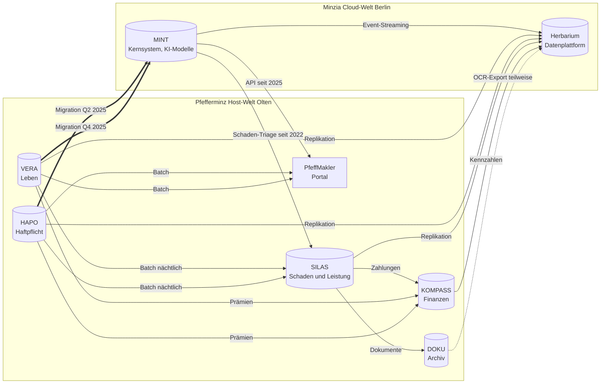

# IT-Landschaft

Stand 31. Dezember 2025. Maschinenlesbar in `data/reference/systeme.csv`. Die Systemnamen sind verbindlich (Entscheidung E04).

## Zwei Welten

Pfefferminzia betreibt die Host-Welt von Pfefferminz und die Cloud-Welt von Minzia nebeneinander. Die Bestände beider Sparten wurden 2025 nach MINT migriert, die Altsysteme laufen als Referenz und für offene Fälle weiter. Das ist der Kern der Integrationsschwierigkeiten und die Quelle der Datenqualitätsprobleme im Datensatz.

| System | Herkunft | Funktion | Technologie | Seit | Status am Stichtag | Abschaltung |
|---|---|---|---|---|---|---|
| VERA | Pfefferminz | Bestand Leben CH und DE | Host, COBOL, nächtlicher Batch | 1994 | Migriert Q4 2025, Parallelbetrieb | 2027 |
| HAPO | Pfefferminz | Bestand Haftpflicht CH und DE | Host, COBOL, eigener Partnerstamm | 1996 | Migriert Q2 2025, Parallelbetrieb | 2026 |
| SILAS | Pfefferminz | Schaden und Leistung beider Sparten | Java Client/Server, Workflow-Engine | 2004 | Produktiv für Altfälle; neue Schäden seit Q3 2025 in MINT | 2027 |
| DOKU | Pfefferminz | Dokumentenarchiv | Dokumentenmanagement, OCR unvollständig | 2008 | Produktiv | 2028 |
| PfeffMakler | Pfefferminz | Broker- und Agenturportal | Web-Portal, Batch-Anbindung | 2011 | Produktiv, API zu MINT | 2027 |
| KOMPASS | Pfefferminz | Finanzen, Solvenz-Reporting | Standard-Finanzsuite | 2016 | Produktiv | offen |
| MINT | Minzia | Kernsystem, Antragsstrecke, KI-Modelle, Chat-Assistent | Cloud-native, Microservices, Event-Streaming, Modell-Registry, LLM-Gateway | 2020 | Zielsystem beider Sparten | offen |
| Herbarium | gemischt | Datenplattform für Analytics und Modelltraining | Lakehouse, Data Catalog, Datenqualitätsregeln | 2025 | Im Aufbau | offen |

## Datenflüsse und Migration

## Migrationswellen 2025

| Welle | Zeitraum | Umfang | Bekannte Artefakte |
|---|---|---|---|
| Haftpflicht | Q2 2025 | Alle HAPO-Verträge nach MINT | 214 Verträge ohne übernommenen Bausteincode (Fall Pieper); Firmennamen mit HTML-Kodierung; Policennummern im Altformat in `legacyAttributes` |
| Leben | Q4 2025 | Alle VERA-Verträge nach MINT | Geburtsdaten-Tippfehler im Testlauf, vor Produktivsetzung korrigiert; DM-Beträge mit Rundungsdifferenzen; Bezugsrechte als Freitext |

Beide Wellen sind im simulierten Migrationslog und in der Feldmapping-Tabelle dokumentiert (Welle 1 des Datensatzes).

## Zwei Partnerstämme

VERA und HAPO führen getrennte Partnerstämme mit achtstelligen Nummern. Dieselbe Person existiert häufig zweimal, mit abweichender Schreibweise oder alter Adresse. MINT verwendet UUID-Schlüssel und hat beide Stämme übernommen, ohne sie zu bereinigen. Die Datenplattform Herbarium führt eine Mapping-Tabelle. Das ist die Dubletten-Übung des Seminars.

## KI-Modelle in MINT

| Modell | Einsatz | Seit | Einstufung |
|---|---|---|---|
| Underwriting-Engine v2 | Vorprüfung Risikoleben, nur positive Entscheide automatisch | 2020 (Minzia), 2025 gruppenweit | Hochrisiko nach EU AI Act Anhang III (Lebensversicherung) |
| Schaden-Triage v3 | Klassifikation und Fast-Track-Zahlung Haftpflicht | 2022 Pilot, 2025 produktiv | Begrenztes Risiko; Vorfall März 2025 (Fall Pieper) |
| Betrugsmodell v2 | Betrugsscore Haftpflicht | 2023 | Begrenztes Risiko; Fairness-Prüfung PLZ-Cluster offen |
| Chat-Assistent | Kundenanfragen zu Bedingungen | 2021 (Minzia-AVB), 2025 erweitert | Transparenzpflicht; kennt Altgenerationen nur teilweise |
| Dokumentklassifikation | Posteingang | 2024 | Minimal |
| Stornoprognose | Bestandsmanagement | 2025 | Begrenztes Risiko |

Das vollständige Modellinventar mit 20 Einträgen ist Anhang der KI-Governance-Richtlinie (Welle 7).

## Kollaboration

Olten und Leipzig arbeiten mit E-Mail und Sitzungsprotokollen, Berlin mit Chat und Wiki. Wissen ist auf beide Welten verteilt; Entscheidungen aus Chat-Threads fehlen in den Protokollen. Die Zusammenführung ist für 2026 geplant.

---

Pfefferminzia ist ein frei erfundenes Unternehmen für Lehrzwecke. Alle Personen, Firmen, Adressen, Verträge, Schäden, Kennzahlen und Ereignisse sind synthetisch erzeugt. Ähnlichkeiten mit real existierenden Personen, Unternehmen oder Marken, insbesondere mit gleichnamigen Medien oder Dienstleistern, sind unbeabsichtigt und nicht intendiert. Rechtliche und regulatorische Aussagen sind vereinfacht, Stand 2026, und ersetzen keine Rechtsberatung. Teile dieses Materials wurden mit Unterstützung von KI erzeugt.
